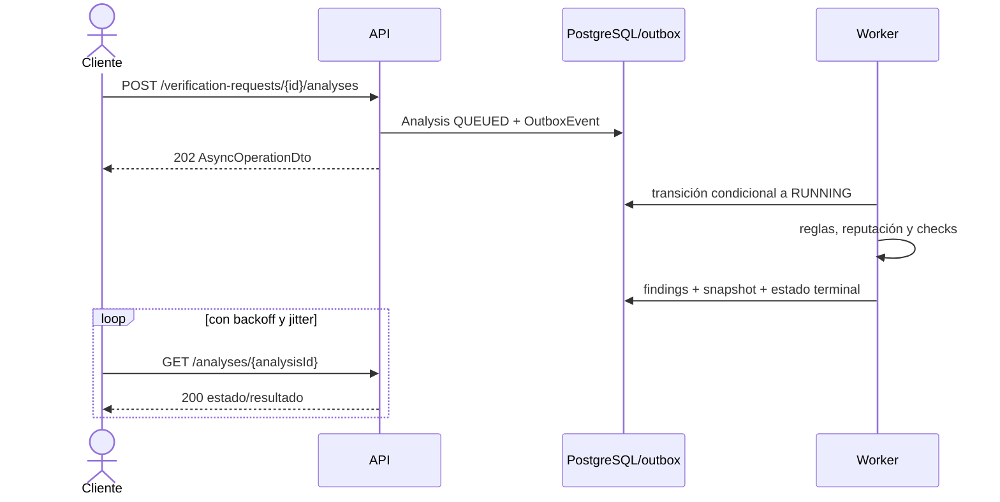

# Diseño de la API REST de Lorica

## 1. Estado y alcance

- **Fase:** 1 — diseño; no existe todavía una API implementada.
- **Base propuesta:** `/api/v1`.
- **Formato principal:** JSON sobre HTTPS.
- **Contrato:** OpenAPI generado y validado en CI.
- **Cliente principal:** web/PWA de Lorica.
- **Actualización asíncrona del MVP:** polling; no WebSocket, SSE ni webhooks inicialmente.

### Trazabilidad

- **Hecho del encargo:** NestJS, REST, OpenAPI, DTO, validación, autorización, errores y pruebas.
- **Decisión propuesta:** convenciones y endpoints descritos aquí.
- **Pendiente:** límites numéricos, tiempos de expiración, proveedores y algunos detalles operativos que necesitan medición o validación legal.

No se fijan versiones de framework o librerías en este documento.

## 2. Principios del contrato

1. **Deny by default:** toda operación es privada salvo los endpoints de autenticación y vista mínima de invitación señalados.
2. **Scope derivado:** el servidor resuelve usuario y espacios accesibles desde la sesión. El cliente nunca envía un `ownerUserId` ni un `dataSpaceId` interno para concederse acceso.
3. **Objetos no enumerables:** IDs opacos, respuestas uniformes y `404` para un recurso inexistente o perteneciente a otro tenant cuando revelar la diferencia sea una fuga.
4. **Mutaciones explícitas:** las transiciones relevantes crean subrecursos (`submissions`, `decisions`, `cancellations`, `publications`) y quedan auditadas.
5. **Asincronía visible:** trabajos costosos responden `202 Accepted` con recurso de estado consultable.
6. **Contrato estricto:** campos desconocidos rechazados, límites de longitud/cantidad y esquemas cerrados.
7. **Explicación sin acusación:** respuestas de riesgo usan señales y limitaciones; no declaran delincuente a una persona o entidad.
8. **Minimización:** listados y notificaciones retornan resúmenes; el detalle sensible exige endpoint y autorización específicos.
9. **No se exponen proveedores:** nombres internos, payloads crudos, secretos y errores de SDK no forman parte del contrato público.

## 3. Convenciones HTTP y de representación

### 3.1 URL, métodos y media types

- Prefijo estable: `/api/v1`.
- Recursos en plural y `kebab-case`.
- IDs opacos en path.
- `GET` no cambia estado funcional.
- `POST` crea recursos o comandos append-only.
- `PATCH` usa JSON Merge Patch para campos documentados y nunca permite mass assignment.
- `DELETE` revoca, cancela o programa eliminación según el recurso; la respuesta y OpenAPI indican la semántica.
- Requests JSON: `Content-Type: application/json`.
- Respuestas JSON: `application/json`.
- Errores: `application/problem+json`.
- Cargas binarias se realizan directamente contra S3/MinIO mediante URL firmada; la API no acepta base64 en JSON.

Las respuestas privadas llevan `Cache-Control: no-store`. La PWA no debe guardarlas en Cache Storage. Las descargas usan `Content-Disposition` seguro y nombre generado/sanitizado.

### 3.2 Fechas, importes, locales e IDs

- Instantes: ISO 8601/RFC 3339 en UTC.
- Fecha aproximada: objeto con precisión explícita (`DAY`, `MONTH`, `YEAR`, `RANGE`, `UNKNOWN`), no un timestamp inventado.
- Importes: string decimal más código de moneda; nunca `float`.
- País y moneda: códigos de catálogo aceptado por el backend.
- Teléfonos, IBAN, correos, dominios y URLs se reciben como strings limitadas; su normalización es responsabilidad del dominio.
- Los IDs se tratan como strings opacas aunque su implementación sea UUID.

### 3.3 Correlation ID

- La API acepta un correlation ID del cliente solo si cumple formato y longitud permitidos; de lo contrario genera uno.
- Siempre lo devuelve en una cabecera documentada y en el cuerpo de error.
- El ID se propaga a outbox/jobs, pero no contiene datos de usuario.

### 3.4 Control de concurrencia

Los recursos mutables devuelven `ETag` basado en una versión opaca. `PATCH`, revocaciones y transiciones susceptibles a carreras requieren `If-Match`:

- falta de precondición cuando es obligatoria: `428 Precondition Required`;
- versión obsoleta: `412 Precondition Failed`;
- transición incompatible con el estado actual: `409 Conflict`.

Una operación append-only, como decidir una aprobación, conserva además constraints de negocio; `ETag` no sustituye la unicidad.

## 4. Autenticación, sesión y CSRF

### Decisión propuesta

- Contraseñas hasheadas con Argon2id y parámetros obtenidos mediante benchmark
  en el entorno objetivo.
- Sesión opaca server-side almacenada en Redis.
- Cookie de sesión `HttpOnly`, `Secure` en TLS, `SameSite=Lax`, `Path=/` y sin
  atributo `Domain`.
- Prefijo de cookie endurecido en producción cuando sea compatible con el despliegue.
- Rotación al autenticar, elevar privilegios y en eventos de seguridad.
- Invalidación al cerrar sesión, cambiar contraseña, suspender o borrar cuenta.
- La cookie no es un bearer token disponible para JavaScript.
- Todas las mutaciones autenticadas requieren token CSRF, validación de
  `Origin`/`Referer` y comprobación del host/proxy confiable conforme a la
  topología same-origin.

`GET /auth/csrf` entrega el material anti-CSRF de forma que no expone la sesión. Login, registro y recuperación también se protegen contra login CSRF y abuso.

**Pendiente:** expiración absoluta e inactiva, política de “recordarme”, durabilidad/fallback si Redis pierde todas las sesiones y mecanismo CSRF concreto. Esos valores deben documentarse y probarse en Fase 2.

### Roles

- **Usuario autenticado:** opera sobre su espacio personal.
- **Family `ADMIN`:** administra grupo, memberships y contactos; no recibe rol global.
- **Family `MEMBER`:** usa recursos familiares según permisos.
- **Family `VERIFIER`:** ve únicamente solicitudes de aprobación asignadas y su resumen mínimo; no obtiene por defecto acceso general a todos los casos/reportes.
- **Moderador global:** capacidades concretas de revisión.
- **Rule manager/global admin:** publicación de reglas, marcas o suspensiones según permiso separado.
- **Sistema/worker:** identidad de servicio limitada a comandos internos.

Los permisos globales no se expresan reutilizando el rol `ADMIN` de una familia.

## 5. DTO y validación

### 5.1 Pipeline obligatorio

Para cada request:

1. validar media type y tamaño antes de parsear;
2. parsear JSON con profundidad/tamaño acotados;
3. rechazar propiedades desconocidas;
4. validar tipos, enums, longitudes, cantidades y formatos;
5. normalizar únicamente en una copia de trabajo, conservando el original cifrado cuando sea necesario;
6. autorizar sobre el recurso y la acción;
7. ejecutar el caso de uso.

No se acepta un objeto Prisma ni entidad de dominio directamente como DTO. Los DTO de creación, parche y respuesta son distintos. Campos como `status`, `riskScore`, `reviewStatus`, `createdByUserId`, `role` global, `objectKey` o `scanResult` nunca se asignan desde un DTO no administrativo.

Los máximos de texto, número de indicadores, destinatarios, archivos, tamaño de archivo, eventos por lote y profundidad JSON serán configuración central documentada en OpenAPI. **Pendiente:** fijar cifras mediante threat model, UX y capacidad; no se inventan aquí.

### 5.2 DTO comunes

#### `ResourceScopeDto`

- `kind`: `PERSONAL` o `FAMILY`
- `familyGroupId`: obligatorio solo para `FAMILY`

El backend traduce este selector a un `DataSpace` accesible. No acepta `dataSpaceId`.

#### `IndicatorInputDto`

- `type`
- `value`
- `label` opcional

El valor no se devuelve sin enmascarar fuera del contexto que lo aportó.

#### `ApproximateDateDto`

- `precision`
- uno de `date`, `month`, `year` o `from`/`to` según precisión
- validación de coherencia y no solapamiento de variantes

#### `MoneyDto`

- `amount`: decimal como string
- `currency`: código admitido

#### `AsyncOperationDto`

- `id`
- `resourceType`
- `status`
- `statusUrl`
- `createdAt`
- `retryAfter` orientativo cuando proceda

No promete tiempo de finalización. Los estados terminales se consultan en el recurso de dominio.

#### `ActorSummaryDto`

- ID opaco y nombre visible conforme al scope
- nunca correo/teléfono completo por defecto

### 5.3 DTO principales de dominio

| DTO | Campos funcionales principales | Reglas destacadas |
|---|---|---|
| `RegisterDto` | email, password, locale, timeZone, termsVersion, privacyNoticeVersionAcknowledged, ageEligibilityAttestation | política de contraseña; atestación afirmativa y versionada sin fecha de nacimiento; respuesta no facilita enumeración |
| `CreateSessionDto` | email, password | error genérico; rate limit por varias dimensiones |
| `CreateFamilyGroupDto` | name | creador pasa a administrador en la misma transacción |
| `CreateFamilyInvitationDto` | email, role | rol permitido; respuesta no confirma si el correo ya es usuario |
| `CreateTrustedContactDto` | email o user reference permitida, displayLabel, intendedRole | al menos un destino; verificación antes de activar |
| `CreateVerificationRequestDto` | scope, context, text opcional, indicators opcionales | puede ser draft vacío; antes de analizar debe haber entrada o evidencia limpia |
| `UpdateVerificationRequestDto` | context, text, indicators | solo draft; reemplazo explícito de colecciones |
| `StartAnalysisDto` | requestedCapabilities opcionales | el servidor limita capacidades; no acepta URL de callback/proveedor |
| `CreateApprovalRequestDto` | familyGroupId, trustedContactIds, share (secciones y recursos seleccionados), message opcional, requestedExpiry opcional | contactos activos del grupo; previsualización y confirmación; expiración dentro de política |
| `CreateApprovalDecisionDto` | decision, comment opcional, supersedesDecisionId opcional | actor debe ser destinatario; decisión terminal única |
| `CreateApprovalCommentDto` | text | participante autorizado; sanitización y límite |
| `CreateFraudReportDto` | scope, category, description, occurred, amountStatus, amounts cuando `KNOWN`, channel, country, visibility, indicators | `KNOWN` exige al menos solicitado o perdido + moneda; `FAMILY` exige grupo accesible; consentimiento colectivo aparte |
| `UpdateFraudReportDto` | campos editables de draft | no permite estado de revisión |
| `CreateIncidentCaseDto` | scope, title, category, summary opcional, occurred range | datos mínimos; no texto legal generado como hecho |
| `CreateIncidentEventDto` | type, occurred, description, money opcional, indicators opcionales | conserva precisión temporal |
| `CreateUploadIntentDto` | scope, targetKind, targetId, purpose, filename, declaredMimeType, sizeBytes, checksum opcional | target enum cerrado; autorización y límites antes de firmar |
| `CompleteUploadDto` | checksum/etag devuelto por almacenamiento | API vuelve a consultar metadata; el cliente no fija object key |
| `CreateConsentRecordDto` | purpose, status, policyVersion/noticeVersion mostrado | finalidades cerradas; retirada append-only |
| `CreateDetectionRuleVersionDto` | ruleKey, name, description, category, weight, DSL, recommendationCode | solo operadores/campos allowlisted; comienza `DRAFT` |
| `ModerationDecisionDto` | decision, reasonCode, note opcional | actor global autorizado, auditado; no acepta score arbitrario |
| `MergeFraudReportDto` | canonicalReportId, reasonCode | evita ciclos; conserva procedencia, evidencias y consentimientos |
| `ReverseFraudReportMergeDto` | reasonCode | solo política permitida; recalcula agregado y audita |

## 6. Idempotencia

### Cabecera

Las creaciones o comandos reintentables aceptan o exigen `Idempotency-Key`, en particular:

- crear y enviar verificaciones;
- iniciar análisis/reintentos;
- crear aprobación y emitir decisión;
- enviar/retirar reporte;
- confirmar upload;
- solicitar exportación;
- publicar regla;
- acciones de moderación con efectos;
- solicitudes de privacidad.

Semántica:

1. scope por usuario/identidad de servicio + método + ruta canónica;
2. se guarda hash del body validado;
3. misma clave y mismo hash devuelve la respuesta original;
4. misma clave y body distinto devuelve `409 IDEMPOTENCY_KEY_REUSED`;
5. dos requests concurrentes no ejecutan dos efectos;
6. la retención de claves y longitud/formato quedan configuradas y documentadas.

La respuesta puede señalar que fue reproducida sin revelar información adicional. La idempotencia HTTP se complementa con claves únicas en PostgreSQL y jobs idempotentes; no sustituye las transacciones.

## 7. Paginación, filtrado y orden

### Convención

- `page[size]`: acotado por endpoint.
- `page[after]`: cursor opaco, firmado o autenticado.
- `sort`: solo valores allowlisted.
- filtros explícitos, por ejemplo `filter[status]`.

Respuesta:

```json
{
  "data": [],
  "meta": {
    "nextCursor": null,
    "hasMore": false
  }
}
```

El cursor incorpora scope, orden y filtros para impedir reutilización confusa o manipulación. El orden por defecto es estable, típicamente `createdAt DESC, id DESC`. No se devuelve total exacto por defecto: puede ser costoso y filtrar volumen. Offset pagination se reserva para catálogos pequeños y estables.

Los filtros desconocidos se rechazan; no existe una sintaxis de consulta arbitraria.

## 8. Modelo de errores

Todas las respuestas de error usan Problem Details:

```json
{
  "type": "https://docs.example.invalid/problems/validation-error",
  "title": "La solicitud no es válida",
  "status": 422,
  "detail": "Revisa los campos indicados.",
  "instance": "/api/v1/verification-requests",
  "code": "VALIDATION_ERROR",
  "correlationId": "opaque-correlation-id",
  "errors": [
    {
      "field": "indicators[0].value",
      "code": "INVALID_FORMAT",
      "message": "El formato no es válido."
    }
  ]
}
```

El dominio de `type` definitivo se decidirá antes de publicar; el ejemplo usa un dominio reservado y no afirma que exista.

### Códigos HTTP

| HTTP | Uso |
|---|---|
| `400` | JSON malformado, cabecera/cursor inválido |
| `401` | sesión ausente, inválida o expirada |
| `403` | autenticado pero sin permiso cuando no hay riesgo de enumeración |
| `404` | recurso inexistente o fuera del scope cuando se debe ocultar esa diferencia |
| `409` | transición/conflicto, duplicado funcional o idempotency key reutilizada |
| `412` | `If-Match` obsoleto |
| `413` | request/archivo declarado demasiado grande |
| `415` | media type no admitido |
| `422` | DTO sintácticamente válido pero campos/reglas de entrada inválidos |
| `428` | falta precondición obligatoria |
| `429` | rate limit; incluye `Retry-After` cuando sea seguro |
| `503` | dependencia interna indispensable no disponible o capacidad temporalmente saturada |

Una integración externa fallida durante un análisis normalmente queda reflejada en `Analysis.coverage` y no convierte el polling en `503`.

### Códigos de aplicación iniciales

`VALIDATION_ERROR`, `AUTHENTICATION_FAILED`, `SESSION_EXPIRED`, `CSRF_FAILED`, `RESOURCE_NOT_FOUND`, `FORBIDDEN`, `STATE_CONFLICT`, `VERSION_MISMATCH`, `IDEMPOTENCY_KEY_REUSED`, `RATE_LIMITED`, `UPLOAD_REJECTED`, `ANALYSIS_FAILED`, `DEPENDENCY_UNAVAILABLE`.

Los mensajes son seguros y traducibles. Stack traces, SQL, object keys, proveedor, token y contenido privado no salen de la API.

## 9. Endpoints por dominio

Los nombres de DTO son contratos a definir en OpenAPI. `Session` significa usuario autenticado; `Global:*` es un permiso administrativo separado. Las respuestas de detalle siempre vuelven a comprobar scope.

### 9.1 Autenticación y perfil

| Método y ruta | Entrada | Salida | Autorización/semántica |
|---|---|---|---|
| `GET /auth/csrf` | ninguna | `CsrfTokenDto` `200` | anónimo o autenticado; no cacheable |
| `POST /auth/register` | `RegisterDto` | `RegistrationAcceptedDto` `202` | anónimo; respuesta uniforme |
| `POST /auth/sessions` | `CreateSessionDto` | `SessionDto` `201` + cookie rotada | anónimo + CSRF/origin; credenciales inválidas genéricas |
| `GET /auth/session` | ninguna | `SessionDto` `200` | Session |
| `DELETE /auth/session` | `If-Match` opcional según mecanismo | `204` | Session; revoca sesión actual |
| `DELETE /auth/sessions` | `RevokeSessionsDto` | `204` | Session con reautenticación; revoca las demás o todas según DTO cerrado |
| `POST /auth/email-verification-requests` | `EmailVerificationRequestDto` | `202` | respuesta uniforme y rate limit |
| `POST /auth/email-verifications` | `VerifyEmailDto` | `EmailVerificationResultDto` `200` | token en body, un solo uso |
| `POST /auth/password-reset-requests` | `PasswordResetRequestDto` | `202` | respuesta uniforme |
| `POST /auth/password-resets` | `ResetPasswordDto` | `204` | token en body; revoca sesiones |
| `GET /me` | ninguna | `UserProfileDto` `200` | Session |
| `PATCH /me` | `UpdateProfileDto` + `If-Match` | `UserProfileDto` `200` | propietario |
| `POST /me/data-exports` | `CreatePersonalExportDto` + idempotency | `AsyncOperationDto` `202` | propietario; proceso asíncrono |
| `GET /me/data-exports/{exportId}` | path | `PersonalExportDto` `200` | propietario |
| `POST /me/data-exports/{exportId}/download-urls` | sin body | `SignedDownloadDto` `201` | propietario, solo `READY`; rate limit y CSRF |
| `POST /me/deletion-requests` | `CreateDeletionRequestDto` + reautenticación + idempotency | `DeletionRequestDto` `202` | propietario |
| `GET /me/deletion-requests/{requestId}` | path | `DeletionRequestDto` `200` | propietario |
| `POST /me/deletion-requests/{requestId}/cancellations` | `If-Match` + idempotency | `DeletionRequestDto` `200` | solo dentro de ventana/política permitida |

El cambio de correo y contraseña se modelará como comandos específicos con reverificación, no como campos libres de `PATCH /me`. Sus endpoints exactos se cerrarán junto al flujo de verificación de correo.

En I1 una cuenta `PENDING_VERIFICATION` puede iniciar sesión y completar el
recorrido local de grupo y verificación, pero no enviar invitaciones, aportar a
reputación colectiva ni acceder a funciones internas. El endpoint de
verificación y un adaptador de entrega de desarrollo dejan preparada la
activación a `ACTIVE`. Antes de un piloto debe decidirse si el correo verificado
será requisito para cualquier uso adicional.

### 9.2 Grupos, memberships, invitaciones y contactos

| Método y ruta | Entrada | Salida | Autorización/semántica |
|---|---|---|---|
| `GET /family-groups` | paginación/filtros | lista `FamilyGroupSummaryDto` | Session; solo memberships activas |
| `POST /family-groups` | `CreateFamilyGroupDto` + idempotency | `FamilyGroupDto` `201` | Session; creador `ADMIN` atómico |
| `GET /family-groups/{groupId}` | path | `FamilyGroupDto` | miembro activo |
| `PATCH /family-groups/{groupId}` | `UpdateFamilyGroupDto` + `If-Match` | `FamilyGroupDto` | Family `ADMIN` |
| `DELETE /family-groups/{groupId}` | `If-Match`, reautenticación | `202` | Family `ADMIN`; programa cierre/borrado |
| `GET /family-groups/{groupId}/memberships` | paginación | `FamilyMembershipDto[]` | miembro; datos mínimos |
| `PATCH /family-groups/{groupId}/memberships/{membershipId}` | `UpdateMembershipRoleDto` + `If-Match` | `FamilyMembershipDto` | `ADMIN`; no elimina último admin |
| `DELETE /family-groups/{groupId}/memberships/{membershipId}` | `If-Match` | `204` | `ADMIN` o self-leave según regla |
| `GET /family-groups/{groupId}/invitations` | paginación | `FamilyInvitationSummaryDto[]` | `ADMIN` |
| `POST /family-groups/{groupId}/invitations` | `CreateFamilyInvitationDto` + idempotency | `FamilyInvitationDto` `201` | `ADMIN`; token solo en canal de entrega |
| `DELETE /family-groups/{groupId}/invitations/{invitationId}` | `If-Match` | `204` | `ADMIN`; revoca |
| `POST /family-invitations/preview` | `InvitationTokenDto` | `InvitationPreviewDto` `200` | anónimo, respuesta mínima, rate limit |
| `POST /family-invitations/accept` | `AcceptInvitationDto` + idempotency | `FamilyMembershipDto` `201` | Session; token en body |
| `GET /family-groups/{groupId}/trusted-contacts` | paginación | `TrustedContactDto[]` | `ADMIN`/`MEMBER` según política |
| `POST /family-groups/{groupId}/trusted-contacts` | `CreateTrustedContactDto` + idempotency | `TrustedContactDto` `201` | `ADMIN`/permiso específico |
| `GET /family-groups/{groupId}/trusted-contacts/{contactId}` | path | `TrustedContactDto` | miembro permitido |
| `PATCH /family-groups/{groupId}/trusted-contacts/{contactId}` | `UpdateTrustedContactDto` + `If-Match` | `TrustedContactDto` | `ADMIN`/creador permitido |
| `DELETE /family-groups/{groupId}/trusted-contacts/{contactId}` | `If-Match` | `204` | revoca; no borra decisiones previas |

El token de invitación no se coloca en query string de la API. El enlace web puede llevarlo en fragmento y enviarlo después en body, reduciendo exposición en logs y referers.

### 9.3 Solicitudes de verificación y análisis

| Método y ruta | Entrada | Salida | Autorización/semántica |
|---|---|---|---|
| `GET /verification-requests` | scope + paginación + status | lista `VerificationRequestSummaryDto` | Session y scope accesible |
| `POST /verification-requests` | `CreateVerificationRequestDto` + idempotency | `VerificationRequestDto` `201` | Session; crea `DRAFT` |
| `GET /verification-requests/{requestId}` | path | `VerificationRequestDto` | acceso al scope |
| `PATCH /verification-requests/{requestId}` | `UpdateVerificationRequestDto` + `If-Match` | `VerificationRequestDto` | creador/permiso, solo `DRAFT` |
| `POST /verification-requests/{requestId}/submissions` | `SubmitVerificationDto` + idempotency | `VerificationRequestDto` `200` | valida que haya entrada apta; pasa a `SUBMITTED` |
| `POST /verification-requests/{requestId}/analyses` | `StartAnalysisDto` + idempotency | `AsyncOperationDto` `202` | exige request `SUBMITTED`; crea el primer análisis o un retry explícito |
| `GET /verification-requests/{requestId}/analyses` | paginación | `AnalysisSummaryDto[]` | acceso al request |
| `POST /verification-requests/{requestId}/cancellations` | `If-Match` + idempotency | `VerificationRequestDto` `200` | cancela según estado; no borra auditoría |
| `GET /analyses/{analysisId}` | path | `AnalysisResultDto` `200` | acceso al scope; usado por polling |
| `GET /analyses/{analysisId}/findings` | filtros + cursor | `AnalysisFindingDto[]` | acceso al análisis |
| `GET /analyses/{analysisId}/external-checks` | cursor | `ExternalCheckSummaryDto[]` | fuente visible permitida, fecha, confianza y caducidad; sin raw, credenciales ni error interno |
| `POST /analyses/{analysisId}/cancellations` | `If-Match` + idempotency | `AnalysisResultDto` `202` o `200` | cancelación cooperativa |

`AnalysisResultDto` contiene `riskScore`, `riskLevel`, motivos, indicadores enmascarados, coincidencias agregadas, acciones que evitar, pasos seguros, cobertura, limitaciones y versiones. En estado no terminal no contiene una puntuación provisional presentada como final.

Invariantes del inicio de análisis:

- la solicitud debe estar en `SUBMITTED`;
- no puede existir otro `Analysis` no terminal para la misma solicitud;
- el primer intento exige que no haya análisis previos;
- un retry solo se admite cuando el intento anterior está en estado terminal
  reintentable (`FAILED`, `CANCELLED` o el estado terminal que la política
  versionada declare reintentable);
- la idempotency key repetida devuelve la operación ya creada y no abre un
  análisis concurrente.

### 9.4 Evidencias y carga de archivos

| Método y ruta | Entrada | Salida | Autorización/semántica |
|---|---|---|---|
| `POST /evidence/upload-intents` | `CreateUploadIntentDto` + idempotency | `UploadIntentDto` `201` | autoriza target/purpose; URL a cuarentena |
| `POST /evidence/{evidenceId}/upload-completions` | `CompleteUploadDto` + idempotency | `EvidenceDto` `202` | verifica objeto y encola scan |
| `GET /evidence/{evidenceId}` | path | `EvidenceDto` | mismo scope/relación autorizada |
| `POST /evidence/{evidenceId}/download-urls` | `DownloadVariantDto` | `SignedDownloadDto` `201` | exige `Evidence.status=AVAILABLE`; variante sanitizada/preview por defecto, original solo por finalidad autorizada; reautoriza |
| `DELETE /evidence/{evidenceId}` | `If-Match` | `202` | desvincula o programa purga según referencias/retención |
| `GET /verification-requests/{requestId}/evidence` | cursor | `EvidenceDto[]` | acceso al request |
| `GET /fraud-reports/{reportId}/evidence` | cursor | `EvidenceDto[]` | acceso al reporte |
| `GET /incident-cases/{caseId}/evidence` | cursor | `EvidenceDto[]` | acceso al expediente |

`UploadIntentDto` contiene la URL firmada, método, cabeceras exactas admitidas, expiración y `evidenceId`. No contiene credenciales S3. Completar la carga no vuelve disponible el archivo; `EvidenceDto.status` se consulta por polling.

El contrato usa las áreas internas `quarantine`, `private` y `derived`: la carga
se firma solo contra `quarantine`; sanitizados, previews y exports se guardan en
`derived`. Un original aceptado pasa a `private` solo si la finalidad, elección
informada y política de retención justifican conservarlo; en otro caso se purga
tras verificar el derivado. Esos nombres no se aceptan como object keys elegidas
por el cliente. `AVAILABLE` es el estado servible de una evidencia; `READY` se
reserva al estado de una exportación y no es un estado de `Evidence`.

### 9.5 Solicitudes de aprobación, decisiones y comentarios

| Método y ruta | Entrada | Salida | Autorización/semántica |
|---|---|---|---|
| `POST /verification-requests/{requestId}/approval-requests` | `CreateApprovalRequestDto` + idempotency | `ApprovalRequestDto` `201` | propietario/miembro; contactos del grupo elegido; crea snapshot mínimo |
| `GET /approval-requests` | role/status + cursor | `ApprovalRequestSummaryDto[]` | requester o destinatario; vista minimizada |
| `GET /approval-requests/{approvalRequestId}` | path | `ApprovalRequestDto` | participante autorizado |
| `GET /approval-requests/{approvalRequestId}/decisions` | cursor | `ApprovalDecisionDto[]` | participante |
| `POST /approval-requests/{approvalRequestId}/decisions` | `CreateApprovalDecisionDto` + idempotency | `ApprovalDecisionDto` `201` | destinatario verificado |
| `GET /approval-requests/{approvalRequestId}/comments` | cursor | `ApprovalCommentDto[]` | participante |
| `POST /approval-requests/{approvalRequestId}/comments` | `CreateApprovalCommentDto` + idempotency | `ApprovalCommentDto` `201` | participante; no modifica decisión |
| `POST /approval-requests/{approvalRequestId}/cancellations` | `If-Match` + idempotency | `ApprovalRequestDto` `200` | solicitante/permiso; solo abierta |

El solicitante previsualiza y confirma el snapshot compartido. Puede incluir
contexto, texto de forma explícita, findings seleccionados, indicadores
enmascarados, limitaciones y derivados de evidencia concretos. El snapshot y su
hash quedan asociados a la decisión. Un contacto verificador no obtiene acceso
a la verificación completa, al historial familiar, a originales no elegidos ni
a reportes.

Cada lectura, comentario y decisión revalida que `ApprovalRecipient` no esté
`REVOKED` y que el contacto/membership siga activo. Revocar un contacto o
membership revoca destinatarios no terminales y bloquea acceso futuro al
snapshot; las decisiones ya emitidas permanecen en el historial del solicitante
y en auditoría.

### 9.6 Reportes colectivos

| Método y ruta | Entrada | Salida | Autorización/semántica |
|---|---|---|---|
| `GET /fraud-reports` | scope/status + cursor | `FraudReportSummaryDto[]` | scope privado accesible |
| `POST /fraud-reports` | `CreateFraudReportDto` + idempotency | `FraudReportDto` `201` | crea `DRAFT` |
| `GET /fraud-reports/{reportId}` | path | `FraudReportDto` | scope o moderador con finalidad |
| `PATCH /fraud-reports/{reportId}` | `UpdateFraudReportDto` + `If-Match` | `FraudReportDto` | autor, solo estados editables |
| `POST /fraud-reports/{reportId}/indicators` | `AddReportIndicatorsDto` + idempotency | `FraudReportDto` | autor, draft |
| `DELETE /fraud-reports/{reportId}/indicators/{indicatorId}` | `If-Match` | `204` | autor, draft |
| `POST /fraud-reports/{reportId}/submissions` | `SubmitFraudReportDto` + idempotency | `FraudReportDto` `200` | autor; pasa a moderación |
| `POST /fraud-reports/{reportId}/withdrawals` | `WithdrawFraudReportDto` + idempotency | `FraudReportDto` `200` | autor; efectos según base jurídica |
| `DELETE /fraud-reports/{reportId}` | `If-Match` | `202` | draft o solicitud de supresión; no oculta obligación legal |

La visibilidad del bruto (`PRIVATE` o `FAMILY`) y el consentimiento para
reputación colectiva son controles separados. El acceso de moderación deriva de
un reporte enviado, finalidad y permiso global, no de una tercera visibilidad.
No existe endpoint público de reportes brutos.

### 9.7 Indicadores y reputación

| Método y ruta | Entrada | Salida | Autorización/semántica |
|---|---|---|---|
| `GET /indicators/{indicatorId}` | path | `IndicatorDto` | solo si relacionado con recurso accesible o permiso global |
| `GET /indicators/{indicatorId}/reputation` | path | `IndicatorReputationDto` | resumen agregado, sin fuentes/tenants |
| `GET /indicators/{indicatorId}/relations` | tipo + cursor | `IndicatorRelationDto[]` | usuario: solo relaciones ya reveladas por su análisis; global: permiso específico |

No hay endpoint global de lookup ni búsqueda parcial de teléfonos, IBAN o
correos. Para comprobar un valor, el usuario crea una verificación privada; el
servidor resuelve el indicador internamente y devuelve únicamente el resultado
del análisis autorizado.

### 9.8 Expedientes, cronología y exportación

| Método y ruta | Entrada | Salida | Autorización/semántica |
|---|---|---|---|
| `GET /incident-cases` | scope/status + cursor | `IncidentCaseSummaryDto[]` | scope accesible |
| `POST /incident-cases` | `CreateIncidentCaseDto` + idempotency | `IncidentCaseDto` `201` | Session |
| `GET /incident-cases/{caseId}` | path | `IncidentCaseDto` | scope |
| `PATCH /incident-cases/{caseId}` | `UpdateIncidentCaseDto` + `If-Match` | `IncidentCaseDto` | autor/rol permitido |
| `DELETE /incident-cases/{caseId}` | `If-Match` | `202` | programa eliminación/archivo conforme a retención |
| `GET /incident-cases/{caseId}/events` | cursor/order | `IncidentEventDto[]` | scope |
| `POST /incident-cases/{caseId}/events` | `CreateIncidentEventDto` + idempotency | `IncidentEventDto` `201` | permiso de edición |
| `GET /incident-cases/{caseId}/events/{eventId}` | path | `IncidentEventDto` | scope |
| `PATCH /incident-cases/{caseId}/events/{eventId}` | `UpdateIncidentEventDto` + `If-Match` | `IncidentEventDto` | permiso; conserva auditoría |
| `DELETE /incident-cases/{caseId}/events/{eventId}` | `If-Match` | `204` o `202` | permiso y política |
| `POST /incident-cases/{caseId}/indicators` | `AddCaseIndicatorsDto` + idempotency | `IncidentCaseDto` | permiso |
| `DELETE /incident-cases/{caseId}/indicators/{indicatorId}` | `If-Match` | `204` | permiso |
| `POST /incident-cases/{caseId}/exports` | `CreateCaseExportDto` + idempotency | `AsyncOperationDto` `202` | permiso de exportar |
| `GET /incident-cases/{caseId}/exports` | cursor | `CaseExportDto[]` | scope |
| `GET /case-exports/{exportId}` | path | `CaseExportDto` | scope; polling |
| `POST /case-exports/{exportId}/download-urls` | sin body | `SignedDownloadDto` `201` | solo `READY`, reautoriza; rate limit y CSRF |
| `DELETE /case-exports/{exportId}` | `If-Match` | `202` | purga derivado |

`CreateCaseExportDto` permite elegir secciones autorizadas y formato soportado; el MVP exige PDF para resumen. El PDF indica limitaciones y separa recomendaciones generales de asesoramiento legal.

### 9.9 Consentimientos, notificaciones y auditoría de usuario

| Método y ruta | Entrada | Salida | Autorización/semántica |
|---|---|---|---|
| `GET /me/consent-records` | purpose + cursor | `ConsentRecordDto[]` | propietario |
| `POST /me/consent-records` | `CreateConsentRecordDto` + idempotency | `ConsentRecordDto` `201` | propietario; grant/withdraw append-only |
| `GET /notifications` | status + cursor | `NotificationDto[]` | destinatario |
| `GET /notifications/{notificationId}` | path | `NotificationDto` | destinatario |
| `POST /notifications/{notificationId}/read-receipts` | idempotency | `NotificationDto` `200` | destinatario |
| `POST /notifications/read-receipts` | `BulkReadReceiptDto` + idempotency | `BulkResultDto` | destinatario; lote acotado |
| `GET /me/audit-events` | action/resource + cursor | `AuditEventSummaryDto[]` | propietario; vista limitada |
| `GET /family-groups/{groupId}/audit-events` | filtros + cursor | `AuditEventSummaryDto[]` | Family `ADMIN`; solo eventos del grupo |

No toda auditoría interna es visible al usuario si contiene señales antiabuso, datos de terceros o controles de seguridad. Cualquier exclusión debe responder a política y derechos aplicables, no a conveniencia técnica.

### 9.10 Moderación, reglas y referencias

Todos los endpoints de esta sección exigen sesión reforzada, permiso global específico, rate limits administrativos y auditoría. Cuando una acción tiene impacto alto se recomienda reautenticación y, según política pendiente, aprobación de dos personas.

#### Reportes e indicadores

| Método y ruta | Entrada | Salida | Permiso |
|---|---|---|---|
| `GET /admin/fraud-reports` | filtros allowlisted + cursor | `ModerationReportSummaryDto[]` | `Global:REPORT_REVIEW` |
| `GET /admin/fraud-reports/{reportId}` | path | `ModerationReportDto` | `Global:REPORT_REVIEW`; acceso auditado |
| `POST /admin/fraud-reports/{reportId}/review-decisions` | `ModerationDecisionDto` + idempotency | `ModerationActionDto` `201` | `Global:REPORT_REVIEW` |
| `POST /admin/fraud-reports/{reportId}/merges` | `MergeFraudReportDto` + idempotency | `ReportMergeDto` `201` | `Global:REPORT_REVIEW`; fusión lógica hacia canónico |
| `POST /admin/fraud-reports/{reportId}/merge-reversals` | `ReverseFraudReportMergeDto` + idempotency | `ReportMergeDto` `201` | `Global:REPORT_REVIEW`; corrige y recalcula |
| `GET /admin/indicators` | exact filters/cursor, no arbitrary query | `AdminIndicatorSummaryDto[]` | `Global:INDICATOR_REVIEW` |
| `GET /admin/indicators/{indicatorId}` | path | `AdminIndicatorDto` | `Global:INDICATOR_REVIEW` |
| `POST /admin/indicators/{indicatorId}/review-decisions` | `IndicatorReviewDecisionDto` + idempotency | `ModerationActionDto` | `Global:INDICATOR_REVIEW` |
| `POST /admin/indicators/{indicatorId}/reputation-recomputations` | `RecomputeReputationDto` + idempotency | `AsyncOperationDto` `202` | `Global:REPUTATION_MANAGE` |

#### Reglas

| Método y ruta | Entrada | Salida | Permiso |
|---|---|---|---|
| `GET /admin/detection-rules` | ruleKey/status + cursor | `DetectionRuleSummaryDto[]` | `Global:RULE_READ` |
| `POST /admin/detection-rules` | `CreateDetectionRuleVersionDto` + idempotency | `DetectionRuleDto` `201` | `Global:RULE_WRITE`; crea draft |
| `GET /admin/detection-rules/{ruleId}` | path | `DetectionRuleDto` | `Global:RULE_READ` |
| `PATCH /admin/detection-rules/{ruleId}` | `UpdateDetectionRuleDraftDto` + `If-Match` | `DetectionRuleDto` | `Global:RULE_WRITE`; `DRAFT` o `VALIDATED`, cualquier cambio vuelve a `DRAFT` |
| `POST /admin/detection-rules/{ruleId}/validations` | `ValidateRuleDto` + idempotency | `RuleValidationResultDto` | `Global:RULE_WRITE`; éxito `DRAFT → VALIDATED`, fallo conserva `DRAFT` |
| `POST /admin/detection-rules/{ruleId}/publications` | `PublishRuleDto` + idempotency | `DetectionRuleDto` | `Global:RULE_PUBLISH`; exige `VALIDATED`, pasa a `PUBLISHED` |
| `POST /admin/detection-rules/{ruleId}/retirements` | `RetireRuleDto` + idempotency | `DetectionRuleDto` | `Global:RULE_PUBLISH`; exige `PUBLISHED`, pasa a `RETIRED` |

No se permite `DELETE` de una regla publicada ni actualizar su DSL. Una nueva configuración crea una nueva versión.

#### Organizaciones y marcas

| Método y ruta | Entrada | Salida | Permiso |
|---|---|---|---|
| `GET /admin/organizations` | filtros/cursor | `OrganizationDto[]` | `Global:REFERENCE_READ` |
| `POST /admin/organizations` | `CreateOrganizationDto` + idempotency | `OrganizationDto` | `Global:REFERENCE_WRITE` |
| `GET /admin/organizations/{organizationId}` | path | `OrganizationDto` | `Global:REFERENCE_READ` |
| `PATCH /admin/organizations/{organizationId}` | `UpdateOrganizationDto` + `If-Match` | `OrganizationDto` | `Global:REFERENCE_WRITE` |
| `GET /admin/known-brands` | filtros/cursor | `KnownBrandDto[]` | `Global:REFERENCE_READ` |
| `POST /admin/known-brands` | `CreateKnownBrandDto` + idempotency | `KnownBrandDto` | `Global:REFERENCE_WRITE` |
| `GET /admin/known-brands/{brandId}` | path | `KnownBrandDto` | `Global:REFERENCE_READ` |
| `PATCH /admin/known-brands/{brandId}` | `UpdateKnownBrandDto` + `If-Match` | `KnownBrandDto` | `Global:REFERENCE_WRITE` |
| `POST /admin/known-brands/{brandId}/indicators` | `AddOfficialIndicatorsDto` + idempotency | `KnownBrandDto` | `Global:REFERENCE_WRITE` |
| `DELETE /admin/known-brands/{brandId}/indicators/{indicatorId}` | `If-Match` | `204` | `Global:REFERENCE_WRITE`; conserva auditoría |

#### Abuso, usuarios y auditoría

| Método y ruta | Entrada | Salida | Permiso |
|---|---|---|---|
| `GET /admin/abuse-signals` | filtros/cursor | `AbuseSignalSummaryDto[]` | `Global:ABUSE_REVIEW` |
| `GET /admin/users/{userId}` | path | `AdminUserSummaryDto` | `Global:USER_SUSPEND`; minimizado |
| `POST /admin/users/{userId}/suspensions` | `SuspendUserDto` + idempotency | `UserStatusDto` | `Global:USER_SUSPEND` |
| `POST /admin/users/{userId}/reinstatements` | `ReinstateUserDto` + idempotency | `UserStatusDto` | `Global:USER_SUSPEND` |
| `GET /admin/audit-events` | filtros/cursor | `AdminAuditEventDto[]` | `Global:AUDIT_READ` |
| `GET /admin/audit-events/{auditEventId}` | path | `AdminAuditEventDto` | `Global:AUDIT_READ`; lectura auditada |

No se expone un endpoint público que fuerce una llamada a una URL, DNS, OCR, VirusTotal o LLM arbitrarios. Esas capacidades solo se invocan desde el orquestador de análisis con políticas de egress.

Una fusión nunca borra el reporte duplicado: establece el canónico, conserva
autor, evidencia, consentimiento, estados y auditoría, y evita que el duplicado
cuente como fuente independiente. Revertirla crea otra acción auditada y
programa el recálculo.

## 10. Flujos asíncronos

### 10.1 Análisis



- `202` puede incluir `Retry-After`.
- El cliente reduce frecuencia, añade jitter y detiene polling en estado terminal.
- La aplicación vuelve a consultar al recuperar foco/conectividad.
- `PARTIAL` incluye resultado y capacidades no disponibles.
- `FAILED` incluye código seguro y posibilidad de retry cuando proceda.
- Un retry crea un nuevo `Analysis`; no reescribe el anterior.

### 10.2 Evidencia

```text
PENDING_UPLOAD -> QUARANTINED -> SCANNING
SCANNING -> REJECTED | INFECTED | SANITIZING
SANITIZING -> AVAILABLE | REJECTED
```

La API comprueba el objeto real antes de encolar. La URL firmada de carga restringe bucket/prefijo, tamaño y cabeceras admitidas en la medida soportada. Una respuesta de almacenamiento exitosa no significa archivo seguro.

### 10.3 Exportación

```text
QUEUED -> RUNNING -> READY | FAILED
READY -> EXPIRED -> DELETED
```

La URL de descarga se solicita aparte y nunca se devuelve permanentemente dentro de `CaseExportDto`. El usuario que inició la exportación puede haber perdido acceso antes de descargar; por eso se reautoriza.

### 10.4 Outbox y semántica

Cada comando que requiere job persiste dominio y outbox en una transacción. La publicación/entrega es al menos una vez. El API contract no promete exactamente una ejecución; promete efecto idempotente observable. Un job contiene IDs y versiones, no texto o PII.

## 11. Autorización detallada

### Matriz mínima

| Recurso/acción | Personal | Family `ADMIN` | Family `MEMBER` | Family `VERIFIER` | Global moderator |
|---|---:|---:|---:|---:|---:|
| Verificación propia/familiar | propietario | sí | según permiso | no, salvo resumen asignado | no por defecto |
| Crear aprobación | propietario que pertenece al grupo de contactos elegido | sí | sí | no | no |
| Ver/decidir aprobación asignada | solo snapshot si participa | si participa | si participa | sí, solo asignada | no |
| Reporte bruto | propietario | según visibilidad | según visibilidad | no | solo enviado + finalidad |
| Expediente/evidencia | propietario | según permiso | según permiso | no por defecto | no por defecto |
| Miembros/contactos | n/a | administrar | lectura limitada | self/minimal | no |
| Reglas/reputación global | lectura saneada | lectura saneada | lectura saneada | lectura en aprobación | permiso global específico |

### Reglas obligatorias

- El guard de rol no basta: el caso de uso comprueba relación con el recurso.
- Bajar/revocar una membership invalida acceso inmediatamente y puede revocar sesiones o permisos cacheados.
- Compartir una verificación con un contacto crea una vista autorizada, no cambia su scope.
- Moderación requiere que el reporte esté enviado o que exista otra finalidad explícita.
- El worker recibe un principal de sistema con capacidad concreta, nunca un “superuser” genérico en el dominio.
- Los errores de otro tenant se comportan como `404` y no cambian por estado interno.

## 12. Seguridad específica de API

### Entrada y salida

- DTO allowlist y rechazo de unknown fields.
- Sanitización contextual al renderizar contenido aportado/OCR/modelo; la API lo etiqueta como no confiable.
- CSP, `X-Content-Type-Options`, política de framing y referrer policy según frontend.
- CORS limitado al origen configurado; nunca wildcard con credentials.
- `Cache-Control: no-store` en datos privados y respuestas de auth.
- Compresión deshabilitada o revisada en respuestas que mezclen secretos y entrada controlada.
- No se aceptan URLs de callback ni plantillas ejecutables.

### Enumeración y abuso

- Login, registro, verificación de correo y reset usan mensajes/tiempos razonablemente uniformes.
- Rate limits por IP/red, sesión, usuario, destino hash y coste del endpoint, con protección frente a proxies mal configurados.
- Invitaciones y tokens tienen alta entropía, un uso, expiración y revocación.
- La resolución de indicadores solo ocurre dentro de verificaciones o recursos
  autorizados; no existe lookup público o autenticado independiente.
- Los listados nunca aceptan filtros de tenant o actor arbitrarios.

### SSRF e integraciones

- El API HTTP no obtiene URLs remotas.
- El worker usa un puerto de fetch seguro: protocolos permitidos, DNS controlado, bloqueo de rangos internos/metadata, límite de redirects/tamaño/tiempo y nueva validación en cada salto.
- Una URL normalizada no se considera segura solo porque el formato sea válido.
- Respuestas crudas externas no llegan directamente al cliente.

### Archivos

- Upload intent previo y URL breve a cuarentena.
- Tamaño declarado y real, magic bytes, MIME, extensión y checksum verificados.
- Archivo en fail-closed si el scanner no está disponible, salvo política explícita que nunca lo haga descargable.
- Sin SVG/HTML/documento activo por defecto para visualización inline.
- EXIF eliminado cuando corresponda; previews generadas, no originales servidos.
- Los nombres originales se tratan como datos, no como path ni cabecera sin sanitizar.

## 13. OpenAPI y ciclo de contrato

### Requisitos

- una operación y `operationId` estable por endpoint;
- tags por dominio;
- schemas separados de request/response;
- security scheme de cookie de sesión y requisito CSRF documentado;
- todos los status esperados y Problem Details;
- ejemplos exclusivamente ficticios y claramente no reales;
- enums, máximos y patrones derivados de configuración única;
- campos sensibles marcados y no incluidos en ejemplos/logging;
- estados asíncronos y transiciones descritos;
- endpoints administrativos en tag/especificación separable sin ocultar su existencia como medida de seguridad.

### Compatibilidad

Dentro de `/v1`:

- añadir campo opcional es compatible si los consumidores toleran la evolución documentada;
- eliminar/renombrar campo, cambiar significado, hacer obligatorio un campo o quitar enum requiere nueva versión o periodo de deprecación;
- añadir un valor enum puede romper clientes exhaustivos: el cliente generado debe incluir fallback `UNKNOWN`;
- errores conservan `code` estable; `detail` puede cambiar/traducirse.

La especificación producida por la aplicación se compara en CI con la aprobada. El cliente web se genera desde esa especificación; no se duplican a mano interfaces que puedan divergir.

## 14. Contrato de pruebas

### 14.1 Por endpoint

Cada operación tendrá:

- caso válido y status/response schema;
- body malformado;
- campo desconocido;
- límites inferior/superior y colección excesiva;
- enum/formato inválido;
- sin sesión, CSRF inválido y rol insuficiente;
- recurso inexistente y recurso de otro tenant indistinguibles cuando aplique;
- ETag ausente/obsoleto;
- idempotency replay y clave reutilizada con body distinto;
- error de dependencia saneado;
- OpenAPI response validation.

### 14.2 Contratos de seguridad

- una familia no puede listar, leer, modificar, decidir, descargar o exportar recursos de otra;
- un verificador solo ve aprobaciones asignadas y campos mínimos;
- un family admin no accede a endpoints globales;
- una suspensión revoca operaciones posteriores;
- password reset/registro no permiten enumerar correo por body, status o diferencia temporal obvia;
- cursors alterados, de otro filtro o tenant fallan sin filtrar información;
- IDs válidos sintácticamente de otro tenant devuelven la respuesta segura definida;
- CSRF se exige también en login y comandos administrativos;
- CORS y cookies se prueban con orígenes permitidos/no permitidos;
- mensajes, tokens, IBAN, correo/teléfono completo, URLs sensibles y object keys no aparecen en logs.

### 14.3 Contratos asíncronos

- commit de dominio sin publicación inmediata queda recuperable por outbox;
- publicar dos veces no duplica efectos;
- dos workers no finalizan dos veces el mismo análisis;
- retry crea un nuevo intento conservando historia;
- proveedor externo caído produce `PARTIAL`/limitación cuando el núcleo puede concluir;
- cancelación impide efectos posteriores aunque una llamada ya iniciada termine;
- evidencia no escaneada/infectada no obtiene download URL;
- export listo se reautoriza y expira;
- polling respeta estados terminales y `Retry-After`.

### 14.4 Contratos de negocio

- scoring y findings citan versiones y desglose;
- una salida LLM inválida no se acepta ni produce puntuación final directa;
- un reporte individual no crea una etiqueta categórica;
- reportes duplicados/coordinados se saturan o excluyen según algoritmo;
- retirar consentimiento excluye nuevas contribuciones y programa recomputación;
- publicación de reglas solo admite DSL allowlisted y versión validada;
- toda decisión de aprobación y moderación genera auditoría.

### 14.5 Pruebas end-to-end mínimas

1. Registro/login → crear grupo → invitar/aceptar → crear verificación → analizar → polling → resultado explicable.
2. Solicitar aprobación → verificador ve resumen mínimo → comenta → decide → solicitante ve historial.
3. Crear reporte con consentimiento separado → enviar → moderar → reputación se recalcula sin exponer bruto.
4. Crear expediente → añadir eventos/evidencia ficticia → scan/sanitización simulados → exportar PDF → descargar con URL temporal.
5. Repetir las rutas anteriores intentando cruzar dos tenants y comprobando denegación.

Todos los fixtures se etiquetan como sintéticos y no se copian de registros
reales. Los dominios usan `.example`; para otros identificadores se usan datos
de sandbox oficiales cuando existan o valores generados y revisados para no
atribuirse a una persona o cuenta real.

## 15. Decisiones pendientes

| Decisión | Impacto | Evidencia necesaria |
|---|---|---|
| Expiración/rotación de sesión y fallback Redis | UX y revocación | threat model, SLO y prueba de caída |
| Mecanismo CSRF concreto | seguridad de mutaciones | spike con frontend/API y cookies reales |
| Límites de DTO/uploads/rate limit | abuso y usabilidad | pruebas de carga y tamaños de uso |
| Express o Fastify | middleware/session/upload | prototipo de Fase 2 |
| Política de cambio de email/password | takeover y UX | diseño de reverificación |
| Política multi-verificador | estado final de aprobación | decisión de producto |
| Visibilidad familiar exacta de reportes/casos | privacidad | UX, roles y DPIA |
| Plazos de idempotency keys y signed URLs | reintentos vs exposición | operación/seguridad |
| Exposición de relaciones de indicadores | riesgo de inferencia | privacidad/moderación |
| Flujos de doble aprobación administrativa | abuso interno | threat model y equipo operativo |
| Dominio público de Problem Details/documentación | estabilidad de contrato | dominio de despliegue |
| Versiones de runtime/dependencias | compatibilidad | matriz verificada en Fase 2 |

## 16. Criterios de aceptación del contrato de la primera iteración

- OpenAPI cubre todas las rutas implementadas bajo `/api/v1`, sin operaciones sin DTO o respuesta documentada.
- Cookie opaca, rotación, logout, CSRF y respuesta uniforme de auth tienen pruebas.
- Validación rechaza campos desconocidos y evita mass assignment.
- Toda consulta privada filtra por scope y las pruebas cruzadas entre dos usuarios/familias fallan de forma segura.
- POST críticos demuestran idempotencia incluso con dos requests concurrentes.
- PATCH/transiciones demuestran control de versión y conflictos.
- El análisis inicial sigue estados consultables mediante polling y outbox, y
  un reintento no duplica hallazgos.
- El contrato futuro de descarga está documentado, pero la carga funcional de
  evidencias y las exportaciones no forman parte de I1.
- Errores siguen Problem Details, incluyen correlation ID y no revelan internals.
- El cliente web se deriva del OpenAPI aprobado.
- Tests de contrato, integración y E2E usan únicamente datos ficticios.
