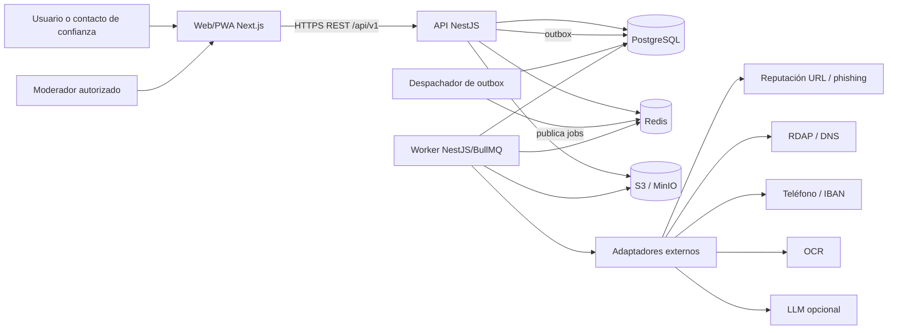
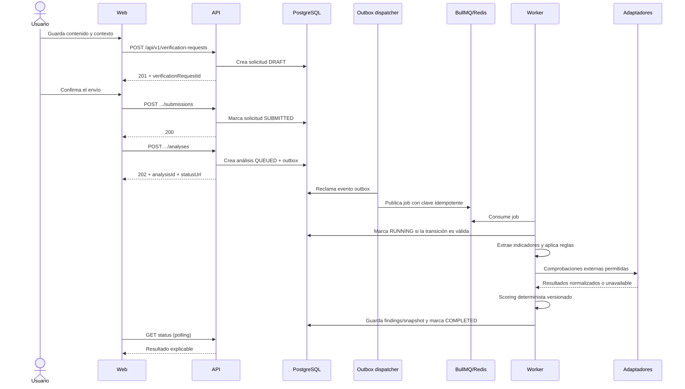
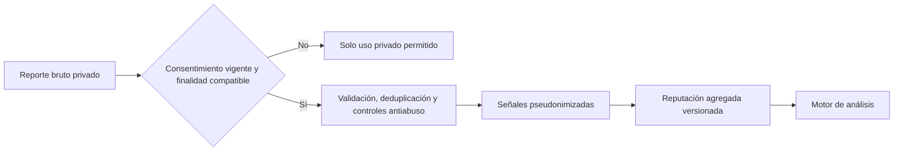

# Arquitectura propuesta de Lorica

## 1. Estado y propósito del documento

- **Fase:** 1 — análisis y diseño.
- **Estado:** propuesta para revisión; no describe una implementación ya existente.
- **Alcance:** arquitectura lógica y física del MVP, límites de módulos, flujos síncronos y asíncronos, integraciones, observabilidad, despliegue local y dependencias candidatas.
- **Fuera de alcance:** código, versiones concretas de dependencias, dimensionamiento de producción y elección de proveedores de pago.

### Convenciones de trazabilidad

Este documento distingue explícitamente:

- **Hecho del encargo:** requisito expresado por el solicitante.
- **Decisión propuesta:** elección de diseño recomendada para la Fase 2.
- **Pendiente:** decisión que necesita validación legal, de producto, operativa o una prueba técnica.

### Estado observado del repositorio

En la inspección inicial no se encontraron archivos de aplicación, manifiestos de dependencias, configuración de infraestructura ni pruebas. Por tanto, no hay arquitectura heredada que preservar ni comportamiento ejecutable que se pueda validar. Los nombres de carpetas y paquetes de este documento son propuestas.

## 2. Restricciones y objetivos arquitectónicos

### Hechos del encargo

- La solución será un monorepo con Next.js, React y TypeScript en el frontend.
- La API será REST, construida con NestJS y documentada con OpenAPI.
- Los datos persistentes residirán en PostgreSQL y se accederá a ellos mediante Prisma.
- Redis se usará para colas, caché y limitación de tasa.
- BullMQ ejecutará trabajos costosos o diferibles.
- Las evidencias se almacenarán mediante una API compatible con S3; MinIO será la implementación local.
- El núcleo debe mantenerse como monolito modular, sin microservicios prematuros.
- El MVP será responsive, instalable como PWA y no moverá dinero ni se conectará a cuentas bancarias, llamadas, SMS, WhatsApp o sistemas operativos.
- El análisis será híbrido y explicable. Un modelo de IA, si se incorpora, será una señal adicional y nunca decidirá por sí solo la puntuación final.
- Los datos son especialmente sensibles y requieren aislamiento por propietario o grupo familiar, auditoría y privacidad desde el diseño.

### Atributos de calidad prioritarios

1. **Seguridad y privacidad:** denegación por defecto, mínimo privilegio, minimización y ausencia de contenido sensible en logs.
2. **Explicabilidad:** cada puntuación debe poder reconstruirse con entradas, versiones, reglas, límites y evidencias.
3. **Fiabilidad:** ningún trabajo crítico debe perderse al separar la transacción de base de datos de la cola.
4. **Mantenibilidad:** límites de módulo verificables y dependencias dirigidas hacia el dominio.
5. **Degradación controlada:** una integración externa caída reduce cobertura, pero no inutiliza el análisis determinista.
6. **Accesibilidad y claridad:** interfaz en español, mobile-first y apta para personas no técnicas.
7. **Trazabilidad:** correlation ID para peticiones y job ID para procesos asíncronos, además de auditoría funcional separada.

## 3. Decisiones de alto nivel

| Tema | Decisión propuesta | Razón | Estado |
|---|---|---|---|
| Organización | Monorepo con `pnpm workspaces`, sin Turborepo inicialmente | Reduce herramientas y complejidad hasta que los tiempos de build justifiquen orquestación adicional | Propuesta acordada para Fase 2 |
| Forma del backend | Monolito modular con una base de código y una base PostgreSQL | Transacciones sencillas y despliegue manejable para un MVP | Propuesta acordada |
| Procesos | `web`, `api` y `worker` como procesos desplegables del mismo sistema | Separa latencia HTTP de tareas costosas sin crear servicios de dominio independientes | Propuesta acordada |
| Consistencia asíncrona | Outbox transaccional, BullMQ y consumidores idempotentes | Evita perder trabajos entre el commit de PostgreSQL y la publicación en Redis | Propuesta acordada |
| Actualización de progreso | Polling de estados en el MVP | Menor superficie operativa que WebSocket/SSE y suficiente para análisis/exportaciones | Propuesta acordada |
| Autenticación web | Sesión opaca server-side, cookie `HttpOnly`, `Secure` y `SameSite=Lax`, almacenada en Redis y rotada; CSRF con token y `Origin`/`Referer` | Evita exponer tokens a JavaScript y permite revocación central | Propuesta acordada; falta cerrar durabilidad y recuperación de Redis |
| Reglas | Configuración versionada con operadores permitidos; sin código arbitrario | Auditabilidad y prevención de ejecución insegura | Propuesta acordada |
| Scoring | Determinista, versionado, explicable, con saturación, límites por familia de señales y compuertas críticas | Evita suma lineal de reportes y conserva trazabilidad | Propuesta acordada |
| Reportes | Reporte bruto privado separado de reputación agregada | Minimización, RGPD y reducción del daño por acusaciones no verificadas | Propuesta acordada |
| Evidencias | Originales en `quarantine`, originales aceptados en `private` con acceso excepcional y derivados sanitizados en `derived` como variante servible por defecto | Reduce exposición a malware, EXIF y contenido activo | Propuesta acordada |
| Contrato API | REST bajo `/api/v1`, OpenAPI como fuente pública y cliente web generado | Reduce divergencia entre frontend y backend | Propuesta |

## 4. Vista de contexto



Los adaptadores no son parte del dominio. Traducen respuestas de proveedores a contratos normalizados y aplican límites, timeout, políticas de red y caché.

## 5. Vista de contenedores y responsabilidades

### `apps/web`

- Renderiza la interfaz en español y la PWA.
- Gestiona formularios, accesibilidad, estados de carga y polling.
- No contiene scoring, decisiones de autorización ni secretos.
- Consume únicamente el contrato REST publicado.
- Mantiene el token CSRF en el mecanismo definido por la API; la sesión permanece inaccesible a JavaScript.
- No descarga una evidencia directamente por una clave de objeto: solicita una URL firmada y temporal tras autorización.

### `apps/api`

- Es el punto de entrada HTTP y composition root de NestJS.
- Autentica la sesión, valida DTO, aplica autorización y rate limits.
- Ejecuta casos de uso de baja latencia.
- Persiste cambios y eventos outbox en una única transacción.
- Devuelve `202 Accepted` para análisis, escaneos y exportaciones diferidas.
- No realiza OCR, acceso a URLs arbitrarias, generación de PDF ni llamadas externas lentas dentro del ciclo HTTP.

### `apps/worker`

- Es un segundo composition root NestJS del mismo monolito modular.
- Consume colas BullMQ y reutiliza casos de uso del backend.
- Ejecuta escaneo, sanitización, OCR, extracción, verificaciones externas, scoring, notificaciones y exportaciones.
- Admite perfiles de ejecución separados (`general`, `files` y `network`) desde
  la misma imagen/código. En entornos desplegados, el perfil `network` se
  ejecuta con identidad y egress propios y sin acceso general a evidencias; el
  perfil `files` procesa contenido sin salida a Internet salvo la estrictamente
  necesaria para el escáner elegido.
- Debe ser idempotente: un reintento no duplica findings, decisiones, reputación ni archivos.
- Registra heartbeat/progreso sin almacenar contenido sensible en logs.

### PostgreSQL

- Fuente de verdad para datos de dominio, estados, versiones de reglas, auditoría y outbox.
- Aplica constraints e índices de aislamiento y unicidad además de las validaciones de aplicación.
- Usa una única secuencia de migraciones mientras exista una sola base compartida.

### Redis

- Almacén de sesiones opacas, colas BullMQ, caché de corta duración y contadores de rate limiting.
- No es fuente de verdad de análisis, reportes, reputación ni auditoría.
- La pérdida de caché no debe corromper datos de dominio.

### S3/MinIO

- Guarda objetos cifrados en reposo según la capacidad del entorno.
- Separa al menos las áreas o buckets lógicos `quarantine`, `private` y `derived`.
- `quarantine` recibe cargas aún no confiables; `private` conserva originales aceptados con acceso excepcional; `derived` contiene versiones sanitizadas, previews y exportaciones.
- Solo expone acceso mediante URLs firmadas de vida corta, después de autorización y comprobación de estado.
- La base de datos conserva metadatos y claves opacas, nunca URLs firmadas persistentes.

## 6. Monolito modular y límites de dominio

Los módulos comparten proceso y base de datos, pero no comparten libremente tablas ni clases internas. Cada tabla tiene un módulo propietario. Un módulo puede usar otro únicamente mediante:

1. un caso de uso o puerto público del módulo propietario;
2. un evento interno versionado;
3. una referencia por identificador estable cuando exista una relación de dominio justificada.

Se prohíbe que un repositorio de un módulo consulte o modifique tablas propiedad de otro para ahorrar una llamada interna. Las vistas de lectura compuestas son una excepción explícita: deben ser read-only, documentadas y no convertirse en un canal de escritura.

| Módulo | Responsabilidad y datos propietarios | Contratos que expone |
|---|---|---|
| Identity & Access | `User`, sesiones, credenciales, verificación de correo, recuperación y estado de cuenta | usuario autenticado, comprobación de rol global, suspensión y revocación |
| Families | `FamilyGroup`, `FamilyMembership`, invitaciones y `TrustedContact` | pertenencia, rol familiar, invitación y resolución de destinatarios |
| Verification | `VerificationRequest`, contexto introducido y vínculos de entrada | crear/consultar solicitud, marcar preparación y solicitar análisis |
| Analysis | `Analysis`, `AnalysisFinding`, `DetectionRule` y snapshots de scoring | ejecutar análisis, consultar resultado explicable y publicar cambios de estado |
| Indicators & Reputation | `Indicator`, `IndicatorType`, relaciones y agregados `IndicatorReputation`; esquema preparado para campañas futuras | normalizar/resolver indicador y obtener/actualizar señal agregada; el MVP no infiere campañas automáticamente |
| Approvals | `ApprovalRequest`, `ApprovalDecision` y comentarios asociados | solicitar, decidir, expirar y consultar historial |
| Reports | `FraudReport`, vínculos con indicadores y estado de envío | crear/editar/enviar/retirar reporte bruto; aportar señales elegibles |
| Cases | `IncidentCase`, `IncidentEvent`, operaciones e índices del expediente | mantener expediente, cronología y snapshot para exportación |
| Evidence | `Evidence`, vínculos, upload intents y ciclo cuarentena–escaneo–sanitización | iniciar/finalizar carga, adjuntar, autorizar descarga y eliminar |
| Integrations | `ExternalCheck`, puertos de proveedor, normalización, caché y políticas de resiliencia | ejecutar comprobación permitida y devolver resultado normalizado |
| Reference Data | `Organization`, `KnownBrand` y alias autorizados | resolver marca/organización y servir reglas de similitud |
| Moderation | cola de revisión, decisiones de moderación, fusión lógica y detección de abuso | revisar reportes/indicadores sin asumir propiedad de sus datos brutos |
| Notifications | `Notification`, preferencias y entrega | crear, marcar leída e intentar entrega por canales permitidos |
| Audit, Consent & Privacy | `AuditEvent`, `ConsentRecord`, solicitudes de derechos y políticas de retención | auditar acciones, comprobar finalidad/consentimiento y ejecutar borrado/exportación |

### Reglas de dependencia

- `domain` no importa NestJS, Prisma, Redis, S3 ni SDK de proveedor.
- `application` depende del dominio y de puertos.
- `infrastructure` implementa puertos y puede depender de frameworks.
- Los controladores HTTP y processors BullMQ llaman a casos de uso; no contienen lógica de negocio.
- `Analysis` consume reputación y comprobaciones externas a través de puertos, no accede a sus tablas.
- `Moderation` ejecuta comandos públicos en `Reports`, `Indicators` o `Identity`; no actualiza sus filas directamente.
- Los eventos no contienen texto completo, IBAN, correo, teléfono, URL con query sensible ni claves de objeto. Solo identificadores y metadatos mínimos.

## 7. Estructura propuesta del monorepo

```text
/
├─ apps/
│  ├─ web/                         # Next.js, React, PWA, UI en español
│  ├─ api/                         # bootstrap HTTP y composition root NestJS
│  └─ worker/                      # bootstrap BullMQ y processors
├─ packages/
│  ├─ backend/
│  │  ├─ src/modules/
│  │  │  ├─ identity/
│  │  │  ├─ families/
│  │  │  ├─ verification/
│  │  │  ├─ analysis/
│  │  │  ├─ indicators/
│  │  │  ├─ approvals/
│  │  │  ├─ reports/
│  │  │  ├─ cases/
│  │  │  ├─ evidence/
│  │  │  ├─ integrations/
│  │  │  ├─ reference-data/
│  │  │  ├─ moderation/
│  │  │  ├─ notifications/
│  │  │  └─ compliance/
│  │  └─ src/platform/             # puertos y adaptadores técnicos compartidos
│  ├─ database/
│  │  ├─ prisma/
│  │  │  ├─ schema.prisma
│  │  │  └─ migrations/
│  │  └─ src/                      # cliente generado y utilidades DB
│  ├─ api-client/                  # cliente generado desde OpenAPI
│  ├─ ui/                          # opcional: solo si se justifican componentes compartidos
│  ├─ config/                      # configuración tipada de build/lint/ts
│  └─ testkit/                     # builders y datos exclusivamente ficticios
├─ infra/
│  ├─ compose/
│  ├─ minio/
│  └─ observability/
├─ docs/
│  ├─ adr/
│  ├─ architecture.md
│  ├─ api-design.md
│  ├─ data-model.md
│  └─ ...
├─ scripts/                        # tareas operativas pequeñas y auditables
├─ pnpm-workspace.yaml
└─ package.json
```

`packages/backend` es una biblioteca privada del monorepo, no un servicio adicional. Permite que API y worker reutilicen dominio y aplicación sin que el worker importe el entry point HTTP. La separación física exacta entre módulos y `platform` deberá reforzarse con reglas de imports en Fase 2.

## 8. Flujos principales

### 8.1 Alta e inicio de sesión

1. La API valida y normaliza el correo sin revelar si ya existe en flujos de recuperación.
2. La contraseña se procesa con Argon2id usando parámetros configurables y revisados para el entorno.
3. Tras autenticación, se crea una sesión opaca con rotación de identificador.
4. El identificador viaja solo en cookie `HttpOnly`, `Secure` en entornos TLS,
   `SameSite=Lax`, `Path=/` y sin `Domain`.
5. Las mutaciones requieren token CSRF y validación de `Origin`/`Referer`
   además de la cookie.
6. Cambio de contraseña, suspensión o borrado revocan las sesiones aplicables.

La política exacta de expiración absoluta/inactiva y el mecanismo de persistencia o recuperación ante caída completa de Redis permanecen pendientes.

### 8.2 Verificación y análisis asíncrono



Propiedades del flujo:

- La creación del análisis y su outbox es atómica. El borrador y su envío son
  transiciones anteriores y explícitas.
- `analysisId` o `outboxEventId` forma parte de la clave del job.
- El worker usa upserts o constraints estables para que un reintento no duplique findings.
- Cada transición de estado compara la versión de fila o el estado esperado.
- Los timeouts de proveedor producen findings de limitación o cobertura, no un falso resultado “seguro”.
- La respuesta conserva las versiones de normalizador, reglas, algoritmo de scoring y adaptadores.
- El usuario ve motivos, acciones seguras y limitaciones; nunca una acusación categórica.

### 8.3 Captura, OCR y análisis de una imagen

1. La API crea un registro `Evidence` en estado `PENDING_UPLOAD` y entrega una URL firmada de carga a cuarentena.
2. El cliente carga directamente al almacenamiento con tamaño y tipo previstos.
3. La API confirma la carga, valida metadatos del objeto y encola el pipeline.
4. El worker verifica firma real del archivo, tamaño y tipo, y llama al puerto de malware scanning.
5. Si el archivo es aceptable, genera en `derived` una versión segura,
   eliminando EXIF cuando corresponda. Solo promueve el original de
   `quarantine` a `private` si la finalidad, elección informada y política de
   retención exigen conservarlo; en otro caso lo purga después de crear y
   verificar el derivado.
6. El OCR recibe únicamente el derivado permitido.
7. El texto OCR se marca por procedencia y confianza; nunca se confunde con texto aportado directamente.
8. El original en cuarentena permanece inaccesible. Si se conserva en
   `private`, su descarga exige finalidad explícita, confirmación, autorización
   actual y auditoría; en los demás casos se purga según el paso anterior.

Un archivo `REJECTED`, `INFECTED` o aún `QUARANTINED` no puede descargarse ni alimentar OCR. `Evidence.status=AVAILABLE` solo se alcanza cuando existe una variante autorizada en `derived` o el caso de uso ha aprobado explícitamente el acceso privado.

### 8.4 Aprobación familiar

1. El propietario de una verificación personal o un miembro autorizado de una
   verificación familiar elige un grupo del que forma parte y contactos activos.
2. La interfaz presenta una previsualización granular de lo que se compartirá.
3. `Families` confirma la pertenencia del solicitante y que cada destinatario es
   contacto verificador activo de ese grupo.
4. `Approvals` crea un snapshot cifrado e inmutable de las secciones confirmadas,
   su hash, destinatarios, notificación y outbox.
5. El verificador consulta solo ese snapshot mediante una concesión explícita;
   no obtiene acceso al `DataSpace` personal ni a la verificación completa.
6. Una decisión `APPROVE`, `REJECT` o `REQUEST_MORE_INFO` se vincula al hash del
   snapshot y se registra append-only con actor y fecha.
7. Revocar el contacto o membership revoca destinatarios abiertos e impide
   nuevas lecturas/decisiones; el historial ya emitido se conserva según acceso
   y auditoría.
8. La respuesta no ejecuta pagos ni otras acciones externas.
9. Las solicitudes vencidas, canceladas o revocadas no aceptan decisiones.

### 8.5 Reporte y reputación colectiva



- Un reporte no cambia directamente un indicador a “fraudulento”.
- La reputación usa señales limitadas por independencia, calidad, recencia y revisión.
- Duplicados y actividad coordinada no incrementan linealmente la puntuación.
- Retirar consentimiento excluye usos futuros y activa la recomputación cuando proceda; no promete borrar hechos cuya conservación tenga otra base jurídica válida.
- El texto libre y los objetos de evidencia no se copian al agregado.

### 8.6 Expediente y exportación PDF

1. El usuario mantiene el expediente y su cronología mediante operaciones síncronas.
2. `POST .../exports` fija un snapshot lógico de los datos autorizados y crea un export en `QUEUED`.
3. El outbox publica el trabajo de renderizado.
4. El worker produce un PDF seguro, sin contenido remoto activo, y lo almacena bajo `derived/exports`.
5. La UI consulta el estado mediante polling.
6. Cuando está `READY`, la API emite una URL firmada de corta duración después de reautorizar al solicitante.
7. La exportación expira y se purga según la política aplicable.

## 9. Motor de análisis

### 9.1 Puerto `ContentAnalyzer`

**Decisión propuesta:** definir un contrato independiente de proveedor, ejecutado por un orquestador de análisis. Su entrada mínima contiene:

- identificador y versión del análisis;
- contenido por fuente (`USER_TEXT`, `OCR_TEXT`, indicador introducido);
- contexto elegido por el usuario;
- idioma cuando se conozca;
- política de minimización y capacidades permitidas.

Su salida se valida contra un esquema cerrado y contiene:

- hechos detectados separados de inferencias;
- tipo y valor normalizado o referencia protegida al indicador;
- ubicación o fragmento mínimo que originó el hallazgo;
- confianza calibrada y procedencia;
- identificador y versión del analizador;
- limitaciones y errores parciales;
- ninguna puntuación final autoritativa.

Implementaciones previstas:

1. **DeterministicContentAnalyzer:** extracción y patrones configurados, primera implementación real.
2. **FakeContentAnalyzer:** resultados reproducibles para pruebas; nunca habilitado por error en producción.
3. **LlmContentAnalyzer:** adaptador futuro, detrás de feature flag y con salida JSON validada.

El orquestador rechaza campos desconocidos, trata una salida inválida como fallo del proveedor y no convierte una afirmación del modelo en una verificación externa.

### 9.2 Puerto de OCR

El contrato de OCR recibe una referencia temporal a un derivado limpio, no un objeto público. Devuelve:

- bloques de texto y posición;
- idioma estimado;
- confianza por bloque;
- versión del proveedor;
- advertencias de calidad.

**Pendiente:** elegir motor local o proveedor, idiomas iniciales, umbral de confianza y base jurídica para enviar imágenes a terceros.

### 9.3 Reglas configurables

- Cada publicación de reglas es inmutable y versionada.
- La configuración solo acepta un catálogo de operadores y campos permitidos.
- No se evalúan scripts, expresiones arbitrarias ni plantillas ejecutables.
- Cada hit conserva regla, versión, evidencia mínima, peso base y recomendación.
- Las reglas se prueban sobre un corpus ficticio antes de publicarse.
- La activación requiere rol de moderación adecuado y queda auditada.

### 9.4 Scoring explicable

El scoring es una función determinista de un snapshot de señales:

- hits de reglas;
- calidad y procedencia de la evidencia;
- reputación agregada, no reportes brutos;
- independencia estimada de fuentes;
- recencia y estado de revisión;
- confianza y frescura de comprobaciones externas;
- cobertura y limitaciones.

La composición propuesta aplica:

- saturación para señales repetidas;
- caps por categoría y fuente;
- deduplicación de indicadores y reportes;
- penalización de señales coordinadas o de baja calidad;
- una compuerta explícita para nivel crítico, basada en combinaciones autorizadas de señales de alta confianza;
- mapeo versionado de puntuación `0..100` a `LOW`, `MEDIUM`, `HIGH`, `CRITICAL`.

El snapshot guarda el desglose suficiente para reproducir el resultado. La
política inicial no calibrada es la fijada en ADR 0003: caps `D=70`, `R=25`,
`X=25`, `A=10`; bandas 0–24, 25–49, 50–74 y 75–100; y compuerta adicional para
`CRITICAL`. Son valores implementables y versionados, no probabilidades. Sigue
pendiente calibrarlos y aprobar cualquier cambio con producto, fraude,
privacidad y seguridad.

## 10. Adaptadores externos y resiliencia

Se preparan puertos separados por capacidad, no un adaptador genérico que permita consultas arbitrarias:

- reputación de URL/phishing;
- RDAP;
- DNS seguro;
- validación de teléfono;
- validación estructural/servicio de IBAN;
- fuentes oficiales;
- OCR;
- clasificación/extracción con LLM opcional;
- malware scanning.

Cada `ExternalCheck` persiste fuente, timestamps, estado, confianza, expiración, versión del adaptador, respuesta normalizada y una referencia protegida al original solo cuando sea lícito.

Controles obligatorios:

- timeout, presupuesto de reintentos, backoff y circuit breaker;
- límites de concurrencia y cuota por proveedor;
- allowlist de protocolos y resolución DNS controlada;
- bloqueo de loopback, link-local, rangos privados, metadatos cloud y redirecciones hacia destinos prohibidos;
- resolución y conexión coherentes para reducir DNS rebinding;
- tamaño máximo, número máximo de redirecciones y prohibición de credenciales embebidas;
- secretos fuera del repositorio;
- caché con TTL según fuente, sin hacer eterna una respuesta;
- mocks deterministas en desarrollo cuando se requieran claves o pago.

La degradación se expresa como `UNAVAILABLE`, `TIMEOUT`, `UNSUPPORTED` o `STALE`; nunca se interpreta como “sin riesgo”.

## 11. Consistencia, outbox e idempotencia

### Patrón outbox

La transacción de dominio inserta también un `OutboxEvent`. Un dispatcher:

1. reclama lotes con bloqueo seguro;
2. publica en BullMQ con `eventId` como job ID;
3. marca el evento como publicado;
4. permite republicación segura si se interrumpe entre los pasos 2 y 3.

La entrega es al menos una vez; por ello, el consumidor debe deduplicar por `eventId` y por clave de efecto. No se promete “exactly once”.

### Política de jobs

- Colas separadas por perfil de riesgo/coste: evidencias, análisis, integraciones, notificaciones, exportaciones y privacidad/retención.
- Intentos y backoff configurados por tipo de error.
- Los errores permanentes no se reintentan indefinidamente.
- Los jobs agotados quedan inspeccionables en estado fallido y generan métrica/alerta.
- El payload contiene IDs, no datos sensibles.
- Cancelar un análisis evita nuevos efectos cuando el processor comprueba el estado; no garantiza interrumpir una llamada externa ya iniciada.

### Concurrencia

- Optimistic locking o actualización condicional para transiciones.
- Constraints de unicidad para decisiones y resultados derivados.
- Locks distribuidos solo si no basta una operación atómica de PostgreSQL/Redis.
- PostgreSQL conserva la autoridad sobre el estado; BullMQ no decide el estado funcional.

## 12. Seguridad transversal

- Autorización en cada caso de uso, no solo en rutas.
- Scope de datos resuelto desde la sesión y el recurso; nunca confiado a un `ownerId` enviado por el cliente.
- DTO con allowlist, rechazo de campos desconocidos y límites antes de trabajo costoso.
- Consultas Prisma parametrizadas; cualquier SQL raw requiere revisión específica.
- Sanitización y renderizado como texto de mensajes, OCR y descripciones.
- CSP y cabeceras defensivas en web/API.
- CSRF para autenticación por cookie; CORS limitado a orígenes configurados.
- Rate limits diferenciados por IP, sesión, cuenta y operación costosa.
- Respuestas uniformes en login, recuperación e invitaciones para reducir enumeración.
- Objetos S3 privados, claves opacas y URLs firmadas breves.
- Separación de logs técnicos, auditoría funcional y contenido de evidencias.
- Secretos suministrados por el entorno o gestor de secretos; validación de configuración al arrancar.
- Egress del worker restringido en despliegue, además de controles de aplicación contra SSRF.

Los detalles se desarrollan en el modelo de amenazas y el diseño de privacidad de la Fase 1.

## 13. Observabilidad

### Logs técnicos

Formato estructurado con, como máximo:

- timestamp, nivel, servicio/proceso y entorno;
- nombre de evento estable;
- correlation ID, request ID, job ID y event ID;
- módulo, ruta normalizada, código de estado y duración;
- clase/código de error saneado;
- identificadores internos pseudonimizados cuando sean imprescindibles.

No se registran mensajes completos, credenciales, cookies, tokens, cabeceras de autorización, IBAN completo, teléfono/correo completo, URLs con query, texto OCR, evidencias ni respuestas crudas de proveedores.

### Auditoría funcional

`AuditEvent` es un registro separado, con acceso más restringido y retención propia. Incluye actor, acción, tipo e identificador de recurso, resultado, momento y contexto mínimo. No sustituye a los logs técnicos ni almacena el contenido completo que cambió.

### Métricas iniciales

- latencia, volumen y errores HTTP por ruta normalizada;
- sesiones creadas/revocadas y rate limits activados, sin etiquetas de usuario;
- duración y estado de análisis;
- profundidad, edad del job más antiguo, reintentos y fallos por cola;
- disponibilidad, latencia y códigos normalizados por adaptador;
- tiempos de escaneo/OCR/exportación;
- eventos outbox pendientes y edad máxima;
- cargas rechazadas por tamaño, MIME o escaneo;
- transiciones de estado inválidas.

Las etiquetas deben tener cardinalidad acotada; no incluir IDs de usuario, recurso, URL o indicador.

### Trazas y salud

- Preparación para OpenTelemetry con propagación entre HTTP, outbox y jobs.
- `liveness`: proceso activo, sin exigir proveedores externos.
- `readiness`: dependencias internas indispensables según proceso; debe distinguir base de datos, Redis y almacenamiento.
- Un proveedor externo caído aparece en métricas/diagnóstico, pero no necesariamente deja la API no preparada.
- Los endpoints detallados de salud requieren protección de red o autorización.

## 14. Despliegue local propuesto

Docker Compose contendrá:

- `postgres`;
- `redis`;
- `minio` y una tarea de inicialización de buckets/políticas;
- `api`;
- `worker`;
- `web`;
- una tarea explícita de migración y, opcionalmente, seed ficticio.

Podrá instanciar más de un servicio desde la misma imagen `worker` para probar
los perfiles de red y archivos. Esto no crea nuevos dominios ni microservicios:
son consumidores con credenciales y políticas de red distintas.

Características:

- un único comando documentado iniciará el entorno después de crear la configuración local;
- health checks y dependencias basadas en salud, no solo en orden de arranque;
- volúmenes persistentes con nombres del proyecto;
- buckets no públicos;
- credenciales locales no reutilizadas como valores de producción;
- mocks para integraciones de pago y modo de correo de desarrollo;
- datos seed inequívocamente ficticios;
- perfiles opcionales de observabilidad, sin hacerlos requisito para el primer arranque.

**Pendiente:** acordar el comando público exacto (`pnpm dev`, `pnpm compose:up` u otro), puertos locales y si web/API se ejecutan con hot reload fuera de contenedor. No se deben documentar como existentes hasta que la Fase 2 los implemente y verifique.

## 15. Dependencias propuestas

No se fijan versiones aquí. Antes de instalarlas se verificará compatibilidad entre Node.js, Next.js, NestJS, Prisma y los adaptadores. Cada alta debe quedar reflejada en lockfile y ADR cuando afecte a arquitectura o seguridad.

| Área | Dependencia/capacidad propuesta | Justificación | Validación pendiente |
|---|---|---|---|
| Workspace | Node.js, `pnpm` workspaces, TypeScript | Runtime y monorepo tipado con lockfile único | versión LTS soportada por todo el conjunto |
| Web | Next.js, React | Requisitos del producto, routing/renderizado y PWA | estrategia exacta de renderizado por pantalla |
| Estilos | Tailwind CSS | Diseño mobile-first consistente | tokens y política de clases |
| Componentes | Radix UI o React Aria, no ambas por defecto | Primitivas accesibles | spike de accesibilidad y ergonomía |
| Formularios | React Hook Form y validación compatible con el contrato | Formularios complejos y errores claros | evitar duplicar reglas del backend |
| PWA | integración de service worker compatible con Next.js | Instalación y caché controlada | revisar soporte de la versión elegida y no cachear datos sensibles |
| API | NestJS y adaptador HTTP elegido | Modularidad, guards, pipes y lifecycle | Express frente a Fastify mediante spike |
| OpenAPI | `@nestjs/swagger` | Contrato documentado y cliente generable | reglas de CI para detectar drift |
| Validación | `class-validator` y `class-transformer`, o esquema alternativo único | DTO estrictos en NestJS | elegir un solo enfoque y validar rechazo de campos desconocidos |
| Persistencia | Prisma y driver PostgreSQL | Requisito y migraciones tipadas | capacidades para constraints/índices avanzados y SQL de migración |
| Sesiones | biblioteca de sesión compatible con NestJS y store Redis | Sesión opaca, revocable y rotada | comportamiento ante failover y fijación de sesión |
| Passwords | paquete Argon2 mantenido con soporte Argon2id | Hash de contraseña requerido | parámetros según memoria/CPU del entorno |
| Redis | cliente Redis mantenido | Sesiones, rate limit, caché y BullMQ | política TLS/autenticación y conexiones separadas |
| Jobs | BullMQ e integración NestJS | Procesamiento asíncrono y reintentos | semántica de shutdown y eventos de cola |
| S3 | AWS SDK for JavaScript, cliente S3 | Compatible con proveedor y MinIO | firma, checksums y multipart |
| Archivos | detector por magic bytes y procesador de imagen mantenido | Validar MIME y generar derivados sin EXIF | formatos aceptados y límites |
| Malware | puerto de escaneo con adaptador a motor elegido | Cuarentena obligatoria | proveedor/motor y comportamiento fail-closed |
| Logging | Pino con integración NestJS | Logging JSON de bajo coste | redacción centralizada y pruebas de no fuga |
| Métricas | cliente Prometheus y health checks NestJS | Métricas/health iniciales | formato y exposición en cada entorno |
| Trazas | paquetes oficiales de OpenTelemetry | Propagación futura sin acoplar dominio | instrumentaciones compatibles |
| Testing API | runner acordado, Supertest y utilidades de contenedores | Unitarias, contrato e integración real | Jest frente a Vitest; estrategia CI |
| Testing web | Testing Library y Playwright | Accesibilidad funcional y E2E | navegadores/matriz CI |
| Calidad | ESLint, Prettier y reglas de límites de imports | Consistencia y protección modular | configuración común mínima |
| PDF | puerto `CaseExporter`; motor aún no elegido | Exportación determinista sin acoplar el dominio a un renderer | fuentes, accesibilidad, aislamiento, tamaño, licencia y contenido hostil en Fase 4 |
| Correo | puerto de entrega y adaptador de desarrollo | Verificación, recuperación e invitaciones sin fijar proveedor | proveedor, región, DPA, antiabuso y entregabilidad |

No se propone todavía un SDK de LLM, OCR, Safe Browsing, VirusTotal, teléfono o IBAN: primero se seleccionará proveedor, finalidad, región, contrato de tratamiento, coste y límites. El dominio dependerá de puertos propios para evitar que esa decisión se filtre al núcleo.

## 16. Escalado y evolución

El sistema no se divide en microservicios por previsión. Antes de extraer un módulo se exigirán evidencias como:

- perfil de carga incompatible con el resto;
- necesidad demostrada de escalado o aislamiento operativo;
- ciclo de despliegue independiente que compense consistencia y observabilidad distribuidas;
- límites de datos y contratos internos ya estables.

La primera respuesta a carga será escalar réplicas stateless de API/worker, separar colas por perfil y optimizar consultas/índices. La base compartida y la outbox facilitan el MVP, pero una futura extracción requerirá ownership de datos y eventos explícitos; los límites definidos arriba preparan esa posibilidad sin pagarla ahora.

## 17. Decisiones pendientes

| Decisión | Quién debe participar | Evidencia necesaria |
|---|---|---|
| Expiración, rotación y recuperación de sesiones si Redis pierde estado | Seguridad y operación | modelo de disponibilidad, política de reautenticación y prueba de failover |
| Express o Fastify en NestJS | Backend | spike de sesiones, CSRF, upload y observabilidad |
| Biblioteca de componentes accesibles | Frontend/UX | prototipo móvil y revisión WCAG |
| Estrategia PWA y caché | Frontend/seguridad | prueba de que respuestas privadas no quedan en Cache Storage |
| Motor de malware scanning | Seguridad/operación | formatos, SLA, aislamiento y coste |
| OCR local o tercero | Producto/privacidad/legal | calidad en español, coste, región y DPA |
| Proveedores de reputación y validación | Producto/legal/seguridad | términos, cuotas, confianza y conservación |
| Calibración o cambio de los valores iniciales de scoring del ADR 0003 | Fraude/producto | corpus ficticio y posteriormente datos etiquetados gobernados |
| Retenciones y base jurídica por categoría | DPO/legal/producto | registro de tratamientos y DPIA |
| Cifrado de campos y servicio de claves | Seguridad/operación | proveedor de despliegue, rotación y recuperación |
| Runtime/dependency versions | Equipo técnico | matriz de compatibilidad y soporte vigente en Fase 2 |
| Objetivos SLO y capacidad inicial | Producto/operación | tráfico, tamaños y tiempos esperados |

## 18. Criterios de aceptación arquitectónicos de la primera iteración

- Los tres procesos (`web`, `api`, `worker`) arrancan localmente junto a PostgreSQL, Redis y MinIO mediante el comando documentado.
- La CI impide imports que vulneren los límites principales de módulo.
- La API publica OpenAPI bajo `/api/v1` y el frontend usa un cliente derivado del contrato.
- Un `Analysis QUEUED` se crea transaccionalmente con su evento outbox, se
  procesa al menos una vez y no duplica resultados al reintentar.
- La UI obtiene estados mediante polling y muestra degradaciones externas como limitaciones.
- MinIO arranca con áreas privadas y sin listing público; el pipeline funcional
  de evidencias queda para las iteraciones definidas en el roadmap.
- Un test de integración demuestra que un usuario de otro espacio no puede leer ni modificar el recurso.
- El scoring conserva versión y desglose reproducible, con reglas versionadas y sin ejecución arbitraria.
- I1 no implementa endpoints de reportes, reputación, expedientes o
  moderación; sus contratos permanecen documentados para fases posteriores.
- Logs y jobs no contienen contenido sensible, y correlation ID/job ID permiten seguir el flujo.

## 19. Referencias técnicas verificadas

- [Guía oficial de PWA de Next.js](https://nextjs.org/docs/app/guides/progressive-web-apps)
- [Integración de colas BullMQ en NestJS](https://docs.nestjs.com/techniques/queues)
- [Transacciones de Prisma ORM](https://www.prisma.io/docs/orm/prisma-client/queries/transactions)
- [Patrón de jobs idempotentes de BullMQ](https://docs.bullmq.io/patterns/idempotent-jobs)
