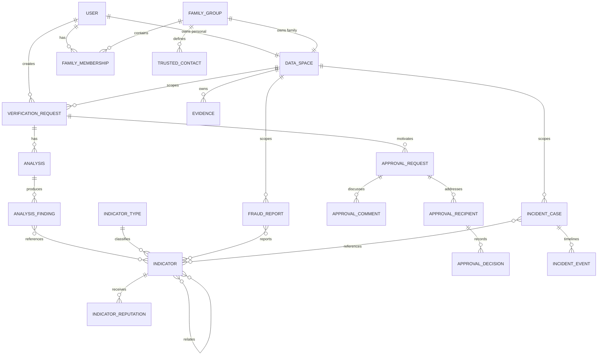
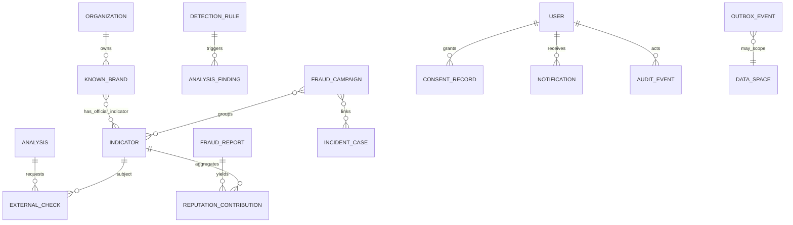

# Modelo de datos inicial de Lorica

## 1. Estado, alcance y convenciones

- **Fase:** 1 — diseño conceptual y lógico.
- **Estado:** propuesta; todavía no existe un esquema Prisma ni una migración ejecutada.
- **Alcance:** entidades mínimas solicitadas, entidades técnicas necesarias, relaciones, aislamiento, estados, constraints, índices, retención y preparación para cifrado de campos.
- **No incluido:** DDL, implementación Prisma, periodos legales definitivos ni datos reales de ejemplo.

Este documento usa:

- **Hecho del encargo:** requisito explícito.
- **Propuesta:** diseño recomendado que debe convertirse en migraciones y pruebas en Fase 2.
- **Pendiente:** decisión que no puede cerrarse sin validación adicional.

Los nombres técnicos se mantienen en inglés para que puedan trasladarse al código. Las explicaciones están en español.

## 2. Principios del modelo

### Hechos del encargo

- Deben existir, como mínimo, `User`, `FamilyGroup`, `FamilyMembership`, `TrustedContact`, `VerificationRequest`, `ApprovalRequest`, `ApprovalDecision`, `Analysis`, `AnalysisFinding`, `Indicator`, `IndicatorType`, `IndicatorReputation`, `FraudReport`, `Evidence`, `IncidentCase`, `IncidentEvent`, `Organization`, `KnownBrand`, `DetectionRule`, `ExternalCheck`, `AuditEvent`, `Notification` y `ConsentRecord`.
- Los indicadores deben formar un grafo sin duplicar sus valores.
- Los reportes no pueden marcar automáticamente como fraudulento un indicador.
- Debe distinguirse información privada de reputación compartida/agregada.
- Se necesita control de acceso por propietario/grupo, auditoría, borrado, exportación y retención.

### Propuestas transversales

1. **Identificadores opacos:** UUID generados por la aplicación o la base de datos. La variante exacta se decidirá tras comprobar soporte; la API no expone significado en el ID.
2. **Tiempo:** todos los instantes se almacenan en UTC con zona y se presentan según el locale del usuario.
3. **Aislamiento:** todo dato privado raíz pertenece a un `DataSpace` técnico de tipo personal o familiar.
4. **Atribución separada de propiedad:** `createdByUserId` identifica al actor, pero no concede acceso por sí mismo.
5. **No hay borrado en cascada de evidencias físicas implícito:** la base marca el ciclo de eliminación y un job idempotente purga objetos.
6. **Datos derivados versionados:** análisis, reputación, normalización y scoring conservan versión y timestamp.
7. **Eventos de decisión append-only:** auditoría y decisiones no se reescriben para ocultar el historial; se corrigen mediante un nuevo evento.
8. **No hay “fraudster” o `isFraudster`:** el modelo representa señales, confianza, revisión y limitaciones, no culpabilidad de personas.

## 3. Aislamiento por espacio de datos

### Entidad técnica `DataSpace`

**Propuesta:** introducir `DataSpace` aunque no aparezca en la lista mínima. Evita columnas ambiguas `ownerUserId`/`familyGroupId` en cada tabla y ofrece una clave uniforme de aislamiento.

| Campo conceptual | Propósito |
|---|---|
| `id` | Clave del tenant técnico |
| `kind` | `PERSONAL` o `FAMILY` |
| `status` | `ACTIVE`, `DELETION_PENDING`, `DELETED` |
| `createdAt`, `updatedAt`, `deletedAt` | Ciclo de vida |

- Cada `User` activo tiene exactamente un espacio `PERSONAL`.
- Cada `FamilyGroup` tiene exactamente un espacio `FAMILY`.
- Las entidades privadas raíz llevan `dataSpaceId NOT NULL`.
- Las entidades hijas sensibles repiten `dataSpaceId` y usan una FK compuesta `(parentId, dataSpaceId)` cuando sea viable. Así, un error de aplicación no puede asociar un hijo a un padre de otro espacio.
- El conjunto de espacios accesibles se deriva de la sesión y de memberships activas; nunca de un `dataSpaceId` confiado al cliente.
- Las tablas globales de referencia o agregación se señalan expresamente y no llevan `dataSpaceId`.

### Matriz de ownership

| Clase de datos | Scope | Regla de acceso |
|---|---|---|
| Perfil y credenciales | Usuario | Solo el usuario y operaciones administrativas justificadas |
| Grupo, miembros y contactos | Familiar | Miembro activo según rol; invitado solo mediante token limitado |
| Verificación, aprobación, caso, evidencia | Personal o familiar | Actor con acceso vigente al `DataSpace` y permiso para la acción |
| Reporte bruto | Personal o familiar | Autor/miembros permitidos; moderación solo tras envío y por finalidad registrada |
| Indicador canónico | Global interno | No enumerable; solo resolución exacta o relación autorizada |
| Reputación de indicador | Global agregada | Resumen limitado; nunca expone reportes o tenants fuente |
| Reglas, marcas y organizaciones | Global administrado | Lectura interna; escritura por rol de moderación/configuración |
| Auditoría | Mismo scope o global administrativo | Acceso restringido, filtrado y con finalidad |

### RLS

**Propuesta pendiente de spike:** añadir PostgreSQL Row-Level Security como defensa en profundidad para tablas con `dataSpaceId`, además de autorización en casos de uso. Con Prisma y pooling debe demostrarse que el contexto de usuario/espacios se fija de forma local a cada transacción y siempre se limpia. Si esa garantía no queda probada en la primera iteración, la autorización de aplicación y las FKs/constraints siguen siendo obligatorias; RLS no se simulará con una configuración insegura.

## 4. Vista relacional resumida

El diagrama omite campos y algunas entidades puente para conservar legibilidad.





## 5. Catálogo de entidades

Los campos indicados son el mínimo de diseño, no una definición Prisma exhaustiva. Todas las entidades mutables incluyen `createdAt`, `updatedAt` y, cuando proceda, `version` para control optimista. Los estados de eliminación se detallan en retención.

### 5.1 Identidad y acceso

#### `User`

Scope propio de identidad, no familiar.

- `id`
- `emailCiphertext`, `emailLookupHash`, `emailKeyVersion`
- `passwordHash`
- `displayNameCiphertext` opcional
- `locale`, `timeZone`
- `emailVerificationStatus`
- `ageEligibilityAttestedAt`, `agePolicyVersion`
- `status`
- `personalDataSpaceId` único
- `lastAuthenticatedAt`
- `createdAt`, `updatedAt`, `deletionRequestedAt`, `deletedAt`

No se almacena contraseña reversible. `emailLookupHash` permite unicidad y login
sin indexar texto claro. La atestación solo registra que el usuario confirmó
cumplir la política de edad vigente; el MVP no recoge fecha de nacimiento.

#### `UserSession` — entidad técnica adicional

- `idHash` o referencia hash del identificador de cookie
- `userId`
- `createdAt`, `lastSeenAt`, `expiresAt`, `absoluteExpiresAt`
- `rotatedFromId` opcional
- `revokedAt`, `revokeReason`
- metadatos de seguridad minimizados, como familia de cliente o hash de IP con retención corta, solo si se justifica

**Decisión acordada:** el estado activo reside en Redis. **Pendiente:** decidir si PostgreSQL conserva únicamente eventos de sesión/auditoría o un registro duradero de revocación/recuperación.

#### `EmailVerificationToken` y `PasswordResetToken` — técnicas adicionales

Guardan solo hash del token, usuario, propósito, expiración, consumo y contador/límite de intentos. Nunca guardan el token en claro.

### 5.2 Familia y confianza

#### `FamilyGroup`

- `id`
- `dataSpaceId` único
- `name`
- `status`
- `createdByUserId`
- timestamps

#### `FamilyMembership`

- `id`
- `familyGroupId`
- `userId`
- `role`: administrador, miembro o contacto verificador
- `status`
- `invitedByUserId` opcional
- `joinedAt`, `leftAt`
- timestamps

La historia puede conservar varias memberships del mismo usuario solo si no se solapan; debe existir una única membership activa por par.

#### `FamilyInvitation` — entidad adicional

- `id`, `familyGroupId`
- `targetEmailCiphertext` y `targetEmailLookupHash`
- `role`
- `tokenHash`
- `createdByUserId`
- `expiresAt`, `acceptedAt`, `revokedAt`
- `acceptedByUserId` opcional

El enlace frontend debe evitar que el token aparezca en logs; la API recibe el secreto en body para aceptación.

#### `TrustedContact`

Representa una relación de confianza definida por un grupo, no una agenda global.

- `id`, `familyGroupId`, `dataSpaceId`
- `contactUserId` opcional
- `contactEmailCiphertext` y/o `contactPhoneCiphertext` si aún no es usuario
- hashes de lookup protegidos cuando se necesiten
- `displayLabelCiphertext`
- `status`, `verifiedAt`
- `createdByUserId`
- timestamps

Debe existir al menos un destino (`contactUserId`, correo o teléfono), pero el MVP puede limitar invitaciones al correo. Teléfono no implica envío de SMS en el MVP.

### 5.3 Verificación y análisis

#### `VerificationRequest`

- `id`, `dataSpaceId`, `createdByUserId`
- `context`
- `status`
- `inputTextCiphertext` opcional
- `inputTextKeyVersion`
- `submittedAt`, `cancelledAt`
- `retentionClass`
- timestamps

Las URLs, teléfonos, correos e IBAN introducidos se representan mediante vínculos a indicadores; no se duplican como columnas de texto claro.

#### `VerificationIndicator`

- `verificationRequestId`, `indicatorId`, `dataSpaceId`
- `source`: manual, extracción de texto u OCR
- `positionStart`, `positionEnd` opcionales
- `displayFragmentCiphertext` mínimo y opcional
- `createdAt`

La FK compuesta confirma que la solicitud pertenece al mismo `dataSpaceId`.

#### `Analysis`

- `id`, `verificationRequestId`, `dataSpaceId`
- `attempt`
- `status`
- `riskScore` opcional hasta finalizar
- `riskLevel` opcional hasta finalizar
- `coverageStatus`
- `ruleSetVersion`, `scoringVersion`, `normalizationVersion`
- `requestedAt`, `startedAt`, `completedAt`
- `failureCode` saneado
- `summaryCiphertext` y `limitations` estructuradas
- `inputSnapshotHash`

Un nuevo análisis crea una nueva fila; no sobrescribe el resultado histórico.

#### `AnalysisFinding`

- `id`, `analysisId`, `dataSpaceId`
- `findingType`
- `factOrInference`
- `category`
- `severity`
- `confidence`
- `sourceType`
- `ruleId` opcional
- `externalCheckId` opcional
- `evidenceFragmentCiphertext` o offsets mínimos
- `explanationCode` y parámetros seguros
- `recommendationCode`
- `scoreContributionBeforeCap`, `scoreContributionAfterCap`
- `createdAt`

El texto visible debería construirse desde códigos y parámetros controlados. El contenido generado por IA se conserva diferenciado y sanitizado.

#### `AnalysisFindingIndicator`

- `analysisFindingId`, `indicatorId`
- `relationship`

Permite que un finding cite varios indicadores sin duplicarlos.

#### `DetectionRule`

Cada fila publicada representa una versión inmutable:

- `id`
- `ruleKey` estable
- `version`
- `name`, `description`, `category`
- `status`
- `weight`
- `configuration` JSON validado contra DSL permitida
- `recommendationCode`
- `effectiveFrom`, `retiredAt`
- `createdByUserId`, `publishedByUserId`
- `createdAt`

No contiene scripts ni expresiones evaluables de propósito general.

#### `ScoringSnapshot` — entidad adicional recomendada

- `analysisId` único
- `algorithmVersion`
- `inputHash`
- componentes por categoría y caps aplicados
- compuertas activadas
- `finalScore`, `riskLevel`
- `createdAt`

El snapshot permite reproducir por qué se obtuvo un resultado aun si las reglas activas cambian después.

### 5.4 Indicadores, grafo y reputación

#### `IndicatorType`

Catálogo administrado:

- `id`
- `code` único, por ejemplo `URL`, `DOMAIN`, `EMAIL`, `PHONE`, `IBAN`, `WALLET`, `MERCHANT`, `LISTING`, `SELLER_PROFILE`
- `normalizationProfile`
- `sensitivityClass`
- `isActive`
- timestamps

Los códigos iniciales son propuesta; no todos requieren el mismo normalizador ni el mismo nivel de exposición.

#### `Indicator`

Entidad global interna que representa identidad canónica, no reputación:

- `id`, `indicatorTypeId`
- `valueCiphertext`
- `valueLookupHash`
- `lookupKeyVersion`
- `normalizationVersion`
- `displayMasked`
- `countryCode` opcional y solo si se deriva de forma fiable
- `firstObservedAt`, `lastObservedAt`
- `mergedIntoIndicatorId` opcional
- timestamps

La existencia de un indicador no afirma riesgo. La API no ofrece listado global
ni lookup independiente sobre valores sensibles: la resolución exacta ocurre
dentro de una verificación privada o de un recurso ya autorizado.

#### `IndicatorLookupAlias` — entidad técnica adicional

Permite rotar la clave HMAC sin crear indicadores canónicos duplicados:

- `id`, `indicatorId`, `indicatorTypeId`
- `valueLookupHash`
- `lookupKeyVersion`, `normalizationVersion`
- `status`: activo, en migración o retirado
- timestamps

Existe unicidad por tipo, hash, versión de normalización y versión de clave. En
una rotación, las lecturas calculan hashes con las versiones admitidas, una
migración crea el alias nuevo y solo después se retira el anterior.

Para URLs se separan:

- dominio/host normalizado, útil para correlación;
- URL completa privada, eliminando fragmentos y protegiendo query/path que puedan contener tokens o PII;
- relación `URL_USES_DOMAIN` entre ambos indicadores.

#### `IndicatorRelation`

Arista del grafo:

- `id`
- `fromIndicatorId`, `toIndicatorId`
- `relationType`
- `direction`
- `confidence`
- `sourceClass`
- `firstObservedAt`, `lastObservedAt`
- `observationCountCapped`
- `reviewStatus`
- `createdAt`, `updatedAt`

Tipos propuestos: `URL_USES_DOMAIN`, `PHONE_REFERENCES_DOMAIN`, `DOMAIN_REQUESTS_PAYMENT_TO_IBAN`, `LISTING_USES_SELLER_PROFILE`, `CO_OCCURS_WITH`, `REDIRECTS_TO` y `SAME_CAMPAIGN`. Las relaciones simétricas se almacenan en orden canónico; las dirigidas conservan dirección.

#### `IndicatorRelationEvidence`

Vincula la arista a una observación autorizada sin incrustar un `subjectType/subjectId` polimórfico sin FK:

- `indicatorRelationId`
- referencia a una observación interna pseudonimizada
- `dataSpaceId` solo en la tabla de enlace privada correspondiente
- `eligibility`
- timestamps

La implementación concreta puede dividirse en enlaces con FK a análisis, reportes o casos para conservar integridad referencial.

#### `IndicatorReputation`

Agregado global y versionado:

- `id`, `indicatorId`
- `algorithmVersion`
- `score` en rango controlado
- `riskBand`
- `confidence`
- contadores saturados por clase, no necesariamente conteos brutos públicos
- `independentSourceBucket`
- `reviewedSignalBucket`
- `abusePenalty`
- `calculatedAt`, `validUntil`
- `status`

Puede conservarse una fila actual más historial, o filas por versión con una vista actual. Nunca contiene texto de reportes ni identidad del reporter.

#### `ReputationContribution` — entidad adicional

Traza interna de señales elegibles:

- `id`
- `indicatorId`
- `fraudReportId` protegido
- `sourceClusterKey` pseudónimo
- `clusteringPolicyVersion`
- `eligibilityStatus`
- `qualityBand`, `recencyBand`, `reviewBand`
- `cappedContribution`
- `algorithmVersion`
- `includedAt`, `excludedAt`, `exclusionReason`

Permite retirar/recalcular sin sumar reportes linealmente.
`sourceClusterKey` agrupa aportaciones correlacionadas conforme a la política
versionada y no se expone fuera de fraude/privacidad/moderación. Su acceso se
restringe a esos módulos autorizados.

#### `FraudCampaign`, `CampaignIndicator`, `CampaignIncident`

Entidades adicionales para “varios incidentes pertenecen a la misma campaña”:

- `FraudCampaign`: identificador, nombre interno no acusatorio, estado de revisión, confianza, método/versión de agrupación y timestamps.
- `CampaignIndicator`: campaña, indicador, rol, confianza y procedencia.
- `CampaignIncident`: campaña, expediente, confianza y estado de revisión.

Estas entidades dejan el esquema preparado, pero la detección automática,
visualización de grafos y gestión de campañas no se implementan en el MVP. Una
fase posterior empezaría cualquier correlación automática como hipótesis y no
como campaña verificada.

### 5.5 Reportes y moderación

#### `FraudReport`

Reporte bruto privado:

- `id`, `dataSpaceId`, `createdByUserId`
- `category`
- `descriptionCiphertext`
- `approximateOccurredOn` o rango aproximado
- `amountStatus`: `KNOWN`, `UNKNOWN` o `NOT_APPLICABLE`
- `amountRequested`, `amountLost`, `currency` opcionales cuando `KNOWN`
- `channel`
- `countryCode`
- `status`
- `visibility`
- `submittedAt`, `withdrawnAt`
- `moderationReasonCode` y nota interna protegida
- `collectiveUseConsentId` opcional
- `duplicateOfReportId` opcional
- timestamps

El estado del importe siempre está presente. Si es `KNOWN`, los importes usan
decimal exacto y moneda; nunca `float`. La fecha aproximada no debe inventar una
precisión no aportada por el usuario.

La fusión es lógica: el reporte duplicado conserva autor, evidencia,
consentimiento e historial, establece `duplicateOfReportId` hacia el canónico y
deja de generar una contribución independiente. No se borran filas para simular
una fusión.

#### `FraudReportIndicator`

- `fraudReportId`, `indicatorId`, `dataSpaceId`
- `role`
- `userAsserted`
- `collectiveEligibility`
- timestamps

Separa la afirmación del usuario de una conclusión revisada.

#### `ModerationAction` — entidad adicional

- `id`
- `targetKind`, `targetId` con validación de aplicación y/o tablas específicas
- `actionType`
- `actorUserId`
- `reasonCode`
- `noteCiphertext` opcional
- `previousState`, `newState`
- `createdAt`

Además genera `AuditEvent`. Si la implementación usa referencias polimórficas, no se utilizarán para conceder acceso; las acciones críticas tendrán constraints o tablas específicas.

#### `AbuseSignal` — entidad adicional

Registra señales técnicas minimizadas de duplicación, automatización o coordinación. Debe tener finalidad, retención corta y acceso restringido. No debe convertirse en perfilado opaco del usuario; cualquier suspensión material requiere reglas y revisión definidas.

### 5.6 Aprobaciones

#### `ApprovalRequest`

- `id`, `dataSpaceId`
- `verificationRequestId`
- `familyGroupId` usado para seleccionar contactos de confianza
- `requestedByUserId`
- `status`
- `messageCiphertext` opcional
- `sharedSnapshotCiphertext`, `sharedSnapshotHash`
- `verificationVersion`, `analysisId` opcional
- `expiresAt`, `completedAt`, `cancelledAt`
- `decisionPolicy`
- timestamps

El snapshot contiene únicamente las secciones que el solicitante previsualizó y
confirmó: contexto, texto si lo incluyó expresamente, findings seleccionados,
indicadores enmascarados, limitaciones y derivados de evidencia autorizados. Es
inmutable; un cambio material crea una solicitud o versión nueva e invalida la
aplicabilidad de decisiones anteriores. El destinatario accede al snapshot, no
a la verificación completa.

#### `ApprovalRecipient` — entidad adicional

- `id`, `approvalRequestId`, `trustedContactId`, `dataSpaceId`
- `recipientUserId`
- `status`
- `notifiedAt`, `viewedAt`
- `revokedAt`, `revokeReason` opcionales
- timestamps

Permite uno o varios contactos sin duplicar la solicitud. `recipientUserId`
constituye una concesión explícita y limitada de lectura/decisión sobre el
snapshot aunque el recurso permanezca en el espacio personal del solicitante;
no concede membership ni acceso al resto de la verificación.

#### `ApprovalDecision`

Evento append-only:

- `id`, `approvalRecipientId`, `approvalRequestId`, `dataSpaceId`
- `decidedByUserId`
- `decision`
- `sharedSnapshotHash`
- `commentCiphertext` opcional
- `createdAt`
- `supersedesDecisionId` opcional

`REQUEST_MORE_INFO` puede preceder una decisión terminal. No se actualiza una decisión ya emitida.

#### `ApprovalComment` — entidad adicional

Mensaje append-only dentro de una solicitud:

- `id`, `approvalRequestId`, `dataSpaceId`
- `authorUserId`
- `textCiphertext`
- `createdAt`
- `redactedAt` opcional y motivo controlado

Solo solicitante y destinatarios autorizados pueden participar. Una redacción por privacidad conserva el evento mínimo de auditoría, pero no el texto. Un comentario no cambia por sí mismo el estado ni equivale a una decisión.

### 5.7 Evidencias

#### `Evidence`

- `id`, `dataSpaceId`, `uploadedByUserId`
- `kind`
- `status`
- `quarantineObjectKey` transitoria
- `privateOriginalObjectKey` opcional tras un escaneo aceptable y solo cuando
  finalidad, elección informada y retención justifican conservar el original
- `derivedObjectKey` y/o `previewObjectKey` para versiones sanitizadas
- `originalFilenameCiphertext`
- `declaredMimeType`, `detectedMimeType`
- `sizeBytes`
- `contentHash`
- `scanProvider`, `scanResult`, `scanVersion`, `scannedAt`
- `sanitizerVersion`, `sanitizedAt`
- `retentionClass`
- `uploadedAt`, `availableAt`, `deletionDueAt`, `deletedAt`
- timestamps

Las object keys son aleatorias y no incluyen nombre, usuario, IBAN ni otro dato. Las URLs firmadas nunca se persisten.

Las áreas lógicas son exactamente:

- `quarantine`: cargas no confiables, nunca descargables por el usuario;
- `private`: originales aceptados, con acceso excepcional y finalidad justificada;
- `derived`: sanitizados, previews, entradas de OCR y otros artefactos servibles.

`AVAILABLE` es un estado de `Evidence`, no el nombre de un área de almacenamiento. La promoción entre áreas se realiza mediante un job idempotente y se confirma en base de datos sin dejar una ventana en la que un objeto de cuarentena sea servible.

#### Enlaces de evidencia

En lugar de una FK polimórfica sin integridad, se proponen:

- `VerificationEvidence`
- `FraudReportEvidence`
- `IncidentEvidence`
- `IncidentEventEvidence`

Cada tabla contiene `evidenceId`, el ID del padre, `dataSpaceId`, propósito y timestamps, con FK compuesta de scope. Un archivo puede vincularse a varios objetos del mismo espacio si la finalidad y retención son compatibles.

### 5.8 Expedientes

#### `IncidentCase`

- `id`, `dataSpaceId`, `createdByUserId`
- `titleCiphertext`
- `status`
- `category`
- `summaryCiphertext`
- `occurredFrom`, `occurredTo` opcionales
- `totalLossAmount`, `currency` cuando sea homogénea
- `legalHoldStatus`
- timestamps

No se presenta el contenido como asesoramiento legal. El total no se deriva si hay varias monedas sin conversión explícita.

#### `IncidentEvent`

- `id`, `incidentCaseId`, `dataSpaceId`
- `eventType`
- `occurredAt` o fecha aproximada/rango
- `recordedAt`
- `descriptionCiphertext`
- `amount`, `currency` opcionales
- `counterpartyIndicatorId` opcional
- `createdByUserId`
- `sequence`
- timestamps

La cronología ordena por fecha aportada y, ante empate/incertidumbre, por `sequence`; conserva que una fecha es aproximada.

#### `IncidentIndicator`

- `incidentCaseId`, `indicatorId`, `dataSpaceId`
- `role`
- timestamps

#### `CaseExport` — entidad adicional

- `id`, `incidentCaseId`, `dataSpaceId`, `requestedByUserId`
- `status`
- `snapshotVersion`, `snapshotHash`
- `derivedObjectKey` opcional, siempre bajo `derived/exports`
- `format`
- `expiresAt`, `completedAt`, `failureCode`
- timestamps

La exportación es un artefacto derivado y temporal, no la fuente de verdad.

### 5.9 Organizaciones y marcas

#### `Organization`

- `id`
- `name`
- `countryCode`
- `organizationType`
- `status`
- `verifiedAt`, `verifiedByUserId`
- timestamps

#### `KnownBrand`

- `id`, `organizationId`
- `displayName`
- `normalizedName`
- `status`
- `effectiveFrom`, `effectiveTo`
- timestamps

Entidades puente adicionales:

- `KnownBrandAlias`: alias normalizado, idioma, origen y revisión.
- `KnownBrandIndicator`: dominios, teléfonos u otros indicadores oficiales, con vigencia y fuente.

“Known” significa que la referencia fue curada conforme a un proceso; no implica que una coincidencia similar sea fraudulenta.

### 5.10 Integraciones

#### `ExternalCheck`

- `id`, `analysisId`, `indicatorId` opcional, `dataSpaceId`
- `capability`, `provider`
- `adapterVersion`
- `status`
- `requestFingerprint`
- `normalizedResult` estructurado y minimizado
- `confidence`
- `checkedAt`, `expiresAt`
- `rawResponseObjectKey` opcional y protegido
- `failureCode`, `durationMs`
- timestamps

La respuesta normalizada se valida. El original solo se conserva cuando haya finalidad, base jurídica y política de retención. Un resultado expirado puede mostrarse como tal, pero no fingirse actual.

### 5.11 Auditoría, consentimiento y notificaciones

#### `AuditEvent`

Append-only:

- `id`
- `dataSpaceId` opcional para eventos globales
- `actorUserId` opcional para sistema
- `actorType`
- `action`
- `resourceType`, `resourceId`
- `outcome`
- `reasonCode`
- `correlationId`
- contexto técnico minimizado
- `occurredAt`
- `previousEventHash`/integridad encadenada, si se adopta

No guarda payloads completos. El acceso a auditoría también genera auditoría.

#### `ConsentRecord`

Append-only y por finalidad:

- `id`, `userId`, `dataSpaceId` opcional
- `purpose`
- `status`: otorgado o retirado
- `policyVersion`, `noticeVersion`
- `lawfulBasis`
- `scope`
- `grantedAt`, `withdrawnAt`
- `source`
- `supersedesConsentRecordId` opcional

No se usa una única casilla para finalidades incompatibles. El consentimiento para reputación colectiva es independiente de términos de servicio y comunicaciones.

#### `Notification`

- `id`, `recipientUserId`, `dataSpaceId` opcional
- `type`
- `status`
- `templateKey`, `templateVersion`
- parámetros mínimos y protegidos
- `relatedResourceType`, `relatedResourceId`
- `scheduledAt`, `sentAt`, `readAt`
- `attemptCount`, `lastFailureCode`
- timestamps

No debe incluir contenido sensible en asunto, push o previsualización.

### 5.12 Entidades operativas

#### `OutboxEvent`

- `id`
- `dataSpaceId` opcional
- `aggregateType`, `aggregateId`
- `eventType`, `eventVersion`
- payload mínimo sin contenido sensible
- `occurredAt`
- `publishedAt`
- `attemptCount`, `nextAttemptAt`, `lastFailureCode`

La entrega es al menos una vez.

#### `ProcessedEvent`

- `consumerName`, `eventId`
- `processedAt`
- `effectKey`

Constraint único por consumidor/evento para apoyar idempotencia. Los efectos de negocio también requieren constraints propios; esta tabla sola no garantiza atomicidad si se escribe fuera de la misma transacción.

## 6. Enums y máquinas de estado

Los valores definitivos se codificarán como enums o tablas controladas según su necesidad de evolución. Los nombres siguientes son propuesta.

### Identidad y familia

- `UserStatus`: `PENDING_VERIFICATION`, `ACTIVE`, `SUSPENDED`, `DELETION_PENDING`, `DELETED`.
- `EmailVerificationStatus`: `UNVERIFIED`, `VERIFIED`.
- `FamilyRole`: `ADMIN`, `MEMBER`, `VERIFIER`.
- `MembershipStatus`: `INVITED`, `ACTIVE`, `LEFT`, `REVOKED`.
- `TrustedContactStatus`: `PENDING`, `ACTIVE`, `REVOKED`.
- `FamilyGroupStatus`: `ACTIVE`, `DELETION_PENDING`, `DELETED`.

En I1, `PENDING_VERIFICATION` identifica correo no verificado, no una cuenta
totalmente bloqueada: puede iniciar sesión y usar el recorrido local de grupo y
verificación, pero no enviar invitaciones, aportar a reputación ni acceder a
funciones internas. La política antes de piloto queda pendiente.

### Verificación y análisis

- `VerificationContext`: `BANK`, `FAMILY`, `MARKETPLACE`, `RENTAL`, `INVESTMENT`, `TECH_SUPPORT`, `INVOICE`, `PUBLIC_ADMINISTRATION`, `OTHER`.
- `VerificationStatus`: `DRAFT`, `SUBMITTED`, `CANCELLED`.
- `AnalysisStatus`: `QUEUED`, `RUNNING`, `COMPLETED`, `PARTIAL`, `FAILED`, `CANCELLED`.
- `CoverageStatus`: `FULL`, `LIMITED`, `DEGRADED`.
- `RiskLevel`: `LOW`, `MEDIUM`, `HIGH`, `CRITICAL`.
- `FactOrInference`: `FACT`, `INFERENCE`.
- `FindingSource`: `DETERMINISTIC_RULE`, `COLLECTIVE_REPUTATION`, `EXTERNAL_CHECK`, `OCR`, `MODEL`.
- `DetectionRuleStatus`: `DRAFT`, `VALIDATED`, `PUBLISHED`, `RETIRED`.

Transiciones principales:

```text
Analysis: QUEUED -> RUNNING -> COMPLETED | PARTIAL | FAILED
          QUEUED | RUNNING -> CANCELLED

DetectionRule: DRAFT -> VALIDATED -> PUBLISHED -> RETIRED
               VALIDATED -> DRAFT
```

`PARTIAL` requiere un resultado determinista válido con una o más capacidades no disponibles. Un fallo total no genera puntuación engañosa.
Una regla `PUBLISHED` es inmutable; cualquier cambio crea una versión nueva.

### Aprobación

- `ApprovalRequestStatus`: `OPEN`, `COMPLETED`, `EXPIRED`, `CANCELLED`.
- `ApprovalRecipientStatus`: `PENDING`, `MORE_INFO_REQUESTED`, `DECIDED`,
  `EXPIRED`, `REVOKED`.
- `ApprovalDecisionType`: `APPROVE`, `REJECT`, `REQUEST_MORE_INFO`.

La política para combinar varios destinatarios (`FIRST_TERMINAL`, unanimidad u otra) queda pendiente de producto. El modelo no la codifica implícitamente.
Si todos los destinatarios no terminales quedan `REVOKED`, la solicitud pasa a
`CANCELLED` con un motivo controlado; no permanece abierta sin destinatarios.

### Reportes y reputación

- `FraudReportStatus`: `DRAFT`, `SUBMITTED`, `UNDER_REVIEW`, `VERIFIED`, `REJECTED`, `INSUFFICIENT_EVIDENCE`, `WITHDRAWN`.
- `ReportVisibility`: `PRIVATE`, `FAMILY`. El acceso de moderación deriva del
  estado enviado, la finalidad y el permiso global; no es una visibilidad
  elegible por sí sola.
- `CollectiveEligibility`: `NOT_CONSENTED`, `PENDING_REVIEW`, `ELIGIBLE`, `EXCLUDED`, `WITHDRAWN`.
- `ReputationStatus`: `CURRENT`, `STALE`, `RECOMPUTING`, `SUPPRESSED`.
- `CampaignReviewStatus`: `HYPOTHESIS`, `UNDER_REVIEW`, `CONFIRMED_RELATION`, `REJECTED`.

`VERIFIED` significa que el reporte cumple el criterio interno de revisión, no que una persona sea culpable ni que todos sus contenidos sean ciertos.

### Evidencia, checks y exportaciones

- `EvidenceStatus`: `PENDING_UPLOAD`, `QUARANTINED`, `SCANNING`, `REJECTED`, `INFECTED`, `SANITIZING`, `AVAILABLE`, `DELETION_PENDING`, `DELETED`.
- `ExternalCheckStatus`: `QUEUED`, `RUNNING`, `SUCCEEDED`, `UNAVAILABLE`, `TIMEOUT`, `UNSUPPORTED`, `FAILED`, `STALE`.
- `CaseStatus`: `OPEN`, `CLOSED`, `ARCHIVED`, `DELETION_PENDING`, `DELETED`.
- `ExportStatus`: `QUEUED`, `RUNNING`, `READY`, `FAILED`, `EXPIRED`, `DELETED`.
- `NotificationStatus`: `PENDING`, `SENT`, `FAILED`, `READ`, `CANCELLED`.

No existe transición desde `INFECTED` a `AVAILABLE`; una carga corregida crea una nueva evidencia.

## 7. Constraints de integridad

### Identidad y acceso

- `User.emailLookupHash` único entre usuarios no eliminados según la política de reutilización pendiente.
- `passwordHash` obligatorio para cuentas de contraseña activas.
- token hashes únicos, con `expiresAt > createdAt`; un token consumido/revocado no puede reutilizarse.
- una membership activa como máximo por `(familyGroupId, userId)`.
- cada grupo debe conservar al menos un administrador activo. La baja del último administrador requiere transferencia o cierre transaccional del grupo.
- una invitación pendiente activa como máximo por grupo, destino y rol, salvo reenvío explícito.

### Scope

- `DataSpace.kind=PERSONAL` se vincula a exactamente un usuario; `FAMILY`, a exactamente un grupo.
- las asociaciones privadas incluyen el mismo `dataSpaceId` que ambos extremos,
  salvo `ApprovalRecipient`, puente ACL explícito hacia un contacto de un grupo
  validado; su `dataSpaceId` coincide con la aprobación y su `familyGroupId`
  se obtiene de `ApprovalRequest.familyGroupId`, que limita el origen del
  contacto.
- `createdByUserId` y IDs enviados por cliente no sustituyen la comprobación de membership.
- no se puede mover un recurso entre espacios mediante `PATCH`; compartir o copiar es un caso de uso explícito y auditado.

### Análisis

- `riskScore` es entero entre `0` y `100` y solo está presente en estados con resultado.
- `riskLevel` debe corresponder al snapshot y versión de scoring.
- `attempt` único por `verificationRequestId`.
- un `ScoringSnapshot` como máximo por análisis finalizado.
- un finding idempotente se identifica por `(analysisId, sourceType, sourceStableKey, occurrenceIndex)` o clave equivalente estable.
- reglas publicadas no se editan; se crea nueva versión.
- una sola versión activa por `ruleKey` y periodo efectivo, mediante índice parcial o validación transaccional.

### Indicadores y reputación

- alias de lookup único por `(indicatorTypeId, valueLookupHash,
  normalizationVersion, lookupKeyVersion)` mientras esté admitido; un indicador
  canónico puede tener aliases de varias claves durante una rotación.
- `mergedIntoIndicatorId` no puede apuntar a sí mismo ni formar ciclos.
- relaciones dirigidas únicas por extremos/tipo/fuente lógica; relaciones simétricas guardan el menor ID primero.
- ninguna arista puede apuntar al mismo indicador salvo tipos expresamente autorizados.
- reputación actual única por `(indicatorId, algorithmVersion)` o vista materializada equivalente.
- una contribución elegible por reporte, indicador, algoritmo y clase de señal.
- el agregador colapsa contribuciones con el mismo
  `(indicatorId, sourceClusterKey, algorithmVersion)` antes de calcular `s`;
- `confidence` y contribuciones usan rangos documentados; no admiten NaN.

### Reportes e importes

- al enviar un reporte debe existir categoría, descripción, fecha aproximada o indicación de desconocida, canal, país/“desconocido” y al menos un indicador o evidencia según la política de producto.
- `visibility=FAMILY` requiere `DataSpace.kind=FAMILY`; `PRIVATE` restringe el
  bruto al autor aunque el recurso esté en un espacio familiar.
- `amountStatus` es obligatorio; con `KNOWN`, `amountRequested` y `amountLost`
  son no negativos, al menos uno está presente y la moneda es obligatoria.
- los códigos de país y moneda se validan contra catálogos versionados, sin inferir país a partir de PII de forma no fiable.
- `duplicateOfReportId` no puede formar ciclos y no borra el reporte original.
- retirar consentimiento cambia elegibilidad; no elimina automáticamente el registro de revisión si existe otra base jurídica documentada.

### Aprobaciones

- una solicitud solo referencia una verificación del mismo espacio.
- el solicitante es miembro activo del `familyGroupId` elegido y los
  destinatarios son contactos activos de ese grupo;
- cada destinatario ve únicamente el snapshot confirmado, tanto si la
  verificación está en un espacio personal como familiar;
- el actor de una decisión debe corresponder al usuario verificado del destinatario.
- una decisión terminal posterior requiere una regla de supersesión explícita; no se permiten dos decisiones terminales activas del mismo destinatario.
- no se aceptan decisiones tras expiración, cancelación o revocación;
- al revocar contacto o membership, los destinatarios no terminales pasan a
  `REVOKED`; cada lectura/decisión revalida estado y relación actual.

### Evidencias y expedientes

- `sizeBytes > 0` y no supera el límite vigente para el tipo.
- `AVAILABLE` requiere MIME detectado permitido, scan aceptable y derivado sanitizado cuando aplique.
- object keys son únicas y no se reutilizan.
- un enlace de evidencia solo une recursos del mismo espacio.
- una exportación `READY` requiere `derivedObjectKey`, hash, tamaño y expiración.
- secuencia de evento única por expediente.

### Auditoría y consentimiento

- `AuditEvent` y `ConsentRecord` no se actualizan ni eliminan mediante flujos ordinarios.
- una retirada crea un nuevo `ConsentRecord` que referencia el anterior.
- la versión del aviso es obligatoria al otorgar consentimiento.
- los eventos outbox no contienen secretos ni payloads completos y tienen versión de esquema.

## 8. Índices propuestos

Los índices se validarán con consultas reales y `EXPLAIN`; no se crearán índices por intuición sin medir.

### Índices de aislamiento y navegación

- cada tabla privada: índice con `dataSpaceId` como primer componente y el campo de orden habitual, por ejemplo `(dataSpaceId, createdAt DESC, id)`;
- `FamilyMembership(userId, status)` para resolver espacios accesibles;
- `FamilyMembership(familyGroupId, status, role)`;
- `TrustedContact(familyGroupId, status)`;
- hijos: `(dataSpaceId, parentId)` y FK compuesta.

### Colas funcionales

- `Analysis(status, requestedAt)` y `(dataSpaceId, requestedAt DESC)`;
- `FraudReport(status, submittedAt)` para moderación, con acceso restringido;
- `Evidence(status, createdAt)` y `Evidence(deletionDueAt)` parciales para pipeline/retención;
- `ExternalCheck(status, createdAt)` y `(requestFingerprint, provider, expiresAt)`;
- `CaseExport(status, createdAt)` y `expiresAt`;
- `OutboxEvent(publishedAt, nextAttemptAt, occurredAt)` parcial donde `publishedAt IS NULL`;
- `Notification(recipientUserId, status, createdAt DESC)`.

### Indicadores y grafo

- único sobre `IndicatorLookupAlias(indicatorTypeId, valueLookupHash,
  normalizationVersion, lookupKeyVersion)`;
- `IndicatorRelation(fromIndicatorId, relationType, lastObservedAt DESC)`;
- `IndicatorRelation(toIndicatorId, relationType, lastObservedAt DESC)`;
- `FraudReportIndicator(indicatorId, collectiveEligibility, createdAt)`;
- `IndicatorReputation(indicatorId, status, calculatedAt DESC)`;
- tablas de campaña por `campaignId` e `indicatorId`.

### Texto y JSON

- No se indexa ciphertext.
- No se propone búsqueda full-text sobre mensajes, OCR o descripciones en el MVP.
- Los JSON normalizados solo reciben índices sobre claves concretas demostradas; no un GIN global por defecto.
- Las vistas de moderación que necesiten texto deben usar capacidades controladas y evitar convertir contenido privado en un índice global.

## 9. Normalización y deduplicación

Cada tipo tiene un normalizador versionado:

- URL: esquema permitido, host IDNA, puerto por defecto, fragmento eliminado y política explícita para query/path;
- dominio: minúsculas, IDNA y punto final normalizado;
- email: normalización conservadora; no eliminar puntos ni aplicar reglas específicas de proveedor sin justificación;
- teléfono: formato canónico solo si se conoce país/contexto con suficiente confianza; conservar incertidumbre;
- IBAN: espacios eliminados, mayúsculas y checksum estructural; checksum válido no prueba legitimidad;
- wallet: normalización por red cuando esta se conoce.

El hash de lookup se calcula sobre
`type + normalizationVersion + normalizedValue` con separación de dominio, una
clave secreta y `lookupKeyVersion` registrada. Tanto una nueva versión de
normalización como una rotación de clave evitan reescribir silenciosamente la
historia:

1. resuelve hashes con las versiones de clave aún admitidas;
2. conserva el mismo indicador canónico y crea el nuevo `IndicatorLookupAlias`;
3. vincula/fusiona cualquier duplicado bajo un proceso auditable;
4. recalcula relaciones y reputación aplicable si cambió la normalización;
5. retira el alias anterior solo al completar migración y verificación.

La deduplicación de reportes considera hash de evidencia autorizado, indicadores, proximidad temporal, similitud y fuente, pero una coincidencia automática solo genera una señal o cola de revisión.

## 10. Preparación para cifrado de campos

### Clasificación

| Clase | Ejemplos | Tratamiento propuesto |
|---|---|---|
| Credencial/secreto | password hash, tokens, cookie de sesión | hash unidireccional; nunca cifrado reversible salvo necesidad explícita |
| Contenido privado | mensaje, OCR, descripción, comentario, cronología | cifrado aleatorio por campo/registro, acceso por caso de uso |
| Identificador sensible | email, teléfono, IBAN, URL completa, wallet | ciphertext + hash HMAC de lookup + representación enmascarada mínima |
| Evidencia binaria | captura/documento/PDF | cifrado del storage, object key opaca y control por metadata DB |
| Agregado | score/bandas sin fuente identificable | acceso controlado; sigue sin asumirse anónimo |
| Referencia pública curada | marca/dominio oficial | texto claro cuando su carácter público y finalidad estén documentados |

### Patrón de columnas

Para campos buscables sensibles:

- `<field>Ciphertext`
- `<field>KeyVersion`
- `<field>LookupHash`
- `<field>DisplayMasked` cuando sea necesario

El ciphertext usa nonce aleatorio y autenticación; el hash HMAC se usa solo para igualdad. No se propone cifrado determinista como sustituto de diseño. La clave de cifrado no reside en la misma base y debe existir rotación por versión mediante envelope encryption o servicio equivalente.

### Riesgos y límites

- Un HMAC de valores de baja entropía sigue siendo sensible si se pierde la clave; debe protegerse y separarse por finalidad/tipo.
- Los metadatos, relaciones y frecuencias pueden revelar información aunque los valores estén cifrados.
- Cifrado de aplicación reduce capacidades de búsqueda; el producto debe aceptar esa limitación.
- PostgreSQL, backups, réplicas, Redis y objetos necesitan cifrado en reposo y transporte, pero eso no sustituye field-level encryption.
- La rotación debe poder leer versiones antiguas y reescribir gradualmente, con auditoría.
- No se registran valores antes de cifrarlos durante fallos.

**Pendiente:** KMS/gestor de claves, jerarquía y separación por entorno, recuperación, rotación, campos exactos y análisis de impacto sobre búsquedas. Debe cerrarse antes de persistir datos reales.

## 11. Retención, borrado y portabilidad

No se inventan periodos. Se propone un catálogo configurable `RetentionPolicy` con:

- `dataCategory`
- finalidad y base jurídica
- evento que inicia el plazo
- duración aprobada
- acción (`DELETE`, `ANONYMIZE`, `REVIEW`)
- versión, vigencia y aprobación

Categorías que necesitan plazos independientes:

- cuenta y perfil;
- sesiones, tokens y señales antiabuso;
- verificaciones y texto;
- evidencias originales en cuarentena;
- derivados limpios/OCR;
- reportes brutos;
- contribuciones/agregados de reputación;
- expedientes y exportaciones;
- respuestas externas crudas/normalizadas;
- notificaciones;
- logs técnicos;
- auditoría;
- consentimientos.

### Flujo de eliminación

1. Marcar recurso o espacio `DELETION_PENDING` e impedir nuevo uso incompatible.
2. Crear outbox/job idempotente con alcance y política aplicable.
3. Eliminar objetos y derivados, después filas o valores de contenido.
4. Recalcular agregados cuando la contribución deje de ser lícita.
5. Conservar únicamente lo exigido por otra base jurídica o legal hold, de forma separada y documentada.
6. Registrar finalización sin copiar el contenido eliminado a auditoría.

Backups requieren una política propia: no se promete borrado inmediato de copias inmutables, pero sí expiración, acceso restringido y no restauración selectiva sin volver a aplicar tombstones.

### Exportación

La portabilidad incluye datos aportados por el usuario y metadatos aplicables en formato estructurado, además de PDF cuando sea útil. Debe excluir datos de terceros, secretos internos, señales antiabuso y razonamientos protegidos cuando exista una excepción válida, justificando la omisión.

## 12. Autorización y consultas seguras

Para cualquier comando o consulta sobre datos privados:

1. resolver `userId` desde la sesión;
2. resolver los `DataSpace` activos mediante membership;
3. cargar el recurso filtrando simultáneamente por `id` y `dataSpaceId`;
4. comprobar rol y estado para la acción;
5. evitar respuestas que distingan “no existe” de “existe en otro tenant”;
6. auditar acciones sensibles.

Nunca se carga primero por ID para comprobar después el tenant si esa diferencia puede filtrarse por timing, error o log. Los listados siempre comienzan por scope. Moderación usa permisos globales separados, finalidad y auditoría; no convierte al moderador en miembro de la familia.

## 13. Decisiones pendientes

| Tema | Riesgo si no se decide | Validación requerida |
|---|---|---|
| Adoptar `DataSpace` técnico | scope inconsistente si se vuelve a owner/group nullable | revisión de queries y prototipo Prisma |
| RLS con Prisma/pooling | falsa sensación de aislamiento | prueba de integración concurrente y revisión de conexión |
| UUID variante y generación | índices/orden o dependencia no verificada | compatibilidad PostgreSQL/Prisma/runtime |
| Catálogo exacto de tipos/relaciones | grafo demasiado rígido o ambiguo | casos de uso y normalizadores |
| Política multi-destinatario de aprobaciones | estado final ambiguo | decisión de producto |
| Umbrales, caps y algoritmo reputacional | falsos positivos/brigading | corpus, threat modeling y gobernanza |
| Plazos de retención/base jurídica | incumplimiento RGPD | DPO/legal, DPIA y registro de tratamiento |
| Campos y KMS de cifrado | fuga o imposibilidad de búsqueda/rotación | diseño criptográfico y spike |
| Reutilización de correo tras borrado | enumeración o bloqueo permanente | política legal/producto |
| Conservación de respuestas externas | exceso de datos/licencias | términos de proveedor y minimización |
| Modelado exacto de moderación polimórfica | pérdida de integridad referencial | consultas esperadas y migración de prueba |

## 14. Contratos de prueba del modelo

Antes de considerar estable el esquema:

- dos usuarios de espacios distintos no pueden cruzar solicitudes, análisis, evidencias, reportes, casos ni exports;
- una FK o constraint impide enlazar una evidencia de un espacio con un recurso de otro;
- memberships concurrentes no crean dos filas activas;
- el último administrador no puede abandonar el grupo sin una transición válida;
- el mismo indicador normalizado se resuelve de forma idempotente, sin exponerlo a otro tenant;
- una nueva versión del normalizador no corrompe referencias históricas;
- dos entregas del mismo evento no duplican findings, decisiones, contribuciones ni exports;
- un reporte duplicado o una misma fuente repetida no se suma linealmente;
- retirar consentimiento excluye la contribución y programa recomputación;
- una regla publicada es inmutable;
- un análisis final conserva scoring y versiones reproducibles;
- una evidencia infectada o no escaneada nunca llega a `AVAILABLE`;
- importes conservan decimales y moneda;
- transiciones inválidas fallan atómicamente;
- ciphertext, hashes y valores enmascarados nunca aparecen en logs de tests;
- el borrado elimina objetos y derivados de forma idempotente y respeta legal holds configurados.
