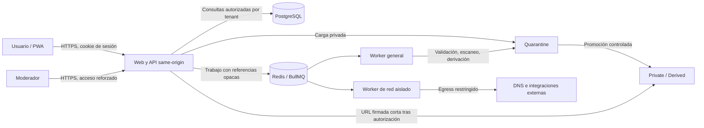

# Modelo de amenazas de seguridad

**Producto:** Lorica  
**Fase:** 1 — análisis y diseño  
**Estado:** borrador para revisión  
**Fecha:** 24 de julio de 2026  
**Ámbito:** MVP web responsive/PWA, API, worker, PostgreSQL, Redis/BullMQ y almacenamiento compatible con S3  

## 1. Propósito y estado de este documento

Este documento define la línea base de seguridad que deberá cumplir Lorica antes de exponer el MVP a usuarios reales. En la fecha de redacción no existe una implementación que permita considerar aplicados estos controles. Las mitigaciones descritas son requisitos y deberán demostrarse mediante pruebas, revisión de configuración o evidencias operativas.

El modelo se revisará cuando cambie cualquiera de estos elementos:

- límites funcionales del MVP;
- arquitectura, proveedor de infraestructura o región de alojamiento;
- categorías de archivos aceptados;
- integraciones externas;
- mecanismo de autenticación;
- modelo de aislamiento entre familias;
- algoritmo de reputación colectiva;
- incorporación de OCR o modelos de IA reales.

Se usará como referencia de verificación [OWASP ASVS 5.0.0](https://owasp.org/www-project-application-security-verification-standard/). Las medidas sobre archivos y SSRF se contrastarán además con las guías oficiales de OWASP sobre [subida de archivos](https://cheatsheetseries.owasp.org/cheatsheets/File_Upload_Cheat_Sheet.html) y [prevención de SSRF](https://cheatsheetseries.owasp.org/cheatsheets/Server_Side_Request_Forgery_Prevention_Cheat_Sheet.html).

## 2. Objetivos de seguridad

1. Proteger la confidencialidad de mensajes, indicadores, relaciones familiares, decisiones y evidencias.
2. Impedir que un usuario, familia, worker, integración o moderador acceda a datos fuera de su autorización.
3. Conservar la integridad y trazabilidad de reglas, análisis, reportes, decisiones y acciones administrativas.
4. Mantener la disponibilidad sin permitir que análisis de URL, OCR, archivos o reportes agoten recursos.
5. Evitar que Lorica se convierta en un proxy hacia redes internas, distribuidor de malware, repositorio público de acusaciones o herramienta de acoso.
6. Limitar el daño si se compromete una cuenta, dependencia, integración, cola o credencial.
7. Producir resultados explicables sin presentar inferencias como hechos ni acusar categóricamente a personas o entidades.

## 3. Alcance y supuestos arquitectónicos

### 3.1 Incluido

- Aplicación web/PWA y API servidas bajo el mismo origen.
- Registro, inicio y cierre de sesión con sesiones opacas almacenadas en servidor.
- Grupos familiares, invitaciones, roles y solicitudes de aprobación.
- Introducción de texto, URL, teléfono, correo, IBAN y otros indicadores.
- Subida, análisis y descarga autorizada de capturas o evidencias.
- Procesamiento asíncrono mediante Redis/BullMQ.
- PostgreSQL como sistema transaccional.
- Almacenamiento de objetos dividido lógicamente en `quarantine`, `private` y `derived`.
- Worker aislado para consultas URL y adaptadores externos.
- Reportes colectivos privados, moderación y reputación agregada.
- Expedientes, cronología y exportación.
- Panel interno de moderación y auditoría.

### 3.2 Fuera de alcance del MVP

- Movimiento de dinero o conexión a cuentas bancarias.
- Interceptación de llamadas, SMS o WhatsApp.
- Monitorización oculta del dispositivo.
- OAuth, passkeys e integraciones automáticas con sistemas operativos.
- Publicación de evidencias o reportes brutos.
- Puntuación final decidida exclusivamente por un modelo de IA.
- Caché offline de respuestas autenticadas, evidencias, informes o expedientes.

### 3.3 Invariantes de diseño

- Un identificador UUID no constituye un control de autorización.
- Todo recurso privado tiene propietario y, cuando corresponda, `familyGroupId`; cada acceso se autoriza en servidor.
- Los objetos se almacenan de forma privada; una URL firmada solo se emite después de autorizar al solicitante y expira en un plazo corto.
- Un archivo no sale de cuarentena hasta completar validación y escaneo con resultado permitido.
- Un reporte individual nunca convierte automáticamente un indicador en “fraudulento”.
- Los workers reciben referencias opacas, no permisos implícitos ni contenido sensible innecesario.
- La PWA puede cachear el shell público, pero no datos autenticados ni respuestas sensibles.
- El cliente nunca decide roles, pertenencia a una familia, estado de moderación ni reputación.

## 4. Método de evaluación

La valoración inicial usa una matriz cualitativa de 5 × 5:

| Valor | Probabilidad | Impacto |
|---:|---|---|
| 1 | Rara | Menor y recuperable |
| 2 | Poco probable | Limitado |
| 3 | Posible | Serio |
| 4 | Probable | Grave |
| 5 | Muy probable | Crítico: daño amplio, financiero, legal o irreversible |

`Riesgo = probabilidad × impacto`.

| Puntuación | Prioridad |
|---:|---|
| 15–25 | Crítica |
| 10–14 | Alta |
| 5–9 | Media |
| 1–4 | Baja |

Las cifras son estimaciones de diseño, no resultados de pruebas. “Residual objetivo” significa el nivel esperado tras implantar y verificar todas las mitigaciones indicadas.

## 5. Activos

| Activo | Sensibilidad | Daño principal si se compromete |
|---|---|---|
| Credenciales, hashes de contraseña y sesiones | Crítica | Toma de cuentas, acceso transversal |
| Membresías, roles e invitaciones familiares | Alta | Suplantación, exposición o manipulación de decisiones |
| Mensajes, capturas, documentos y OCR | Crítica | Exposición de datos personales, credenciales o hechos íntimos |
| Teléfonos, correos, IBAN, wallets y perfiles | Crítica | Fraude, doxing, acusación o correlación de personas |
| Expedientes, cronologías e importes | Crítica | Perjuicio financiero, legal o reputacional |
| Decisiones y comentarios familiares | Alta | Manipulación de una operación o conflicto familiar |
| Reportes brutos e identidad del reportante | Crítica | Represalias, difamación, reidentificación |
| Reputación y relaciones entre indicadores | Alta | Falsos positivos, envenenamiento del sistema |
| Reglas, pesos y configuración de scoring | Alta | Manipulación sistemática del resultado |
| Evidencias de moderación y auditoría | Alta | Repudio, abuso interno sin trazabilidad |
| Secretos, claves de cifrado y credenciales de proveedores | Crítica | Compromiso masivo o uso fraudulento de terceros |
| Colas, trabajos y cachés | Alta | Ejecución no autorizada, fuga o indisponibilidad |
| Backups y exportaciones | Crítica | Fuga masiva y persistencia tras el borrado lógico |
| Disponibilidad y confianza del servicio | Alta | Usuarios incapaces de verificar una operación urgente |

## 6. Actores y capacidades

| Actor | Acceso legítimo | Riesgos relevantes |
|---|---|---|
| Visitante no autenticado | Registro, inicio, contenido público mínimo | Enumeración, credential stuffing, abuso de invitaciones, DoS |
| Usuario autenticado | Sus recursos y grupos autorizados | IDOR, subida maliciosa, reportes falsos, extracción masiva |
| Administrador familiar | Gestión de su grupo | Abuso de rol, expulsión o acceso excesivo a datos de miembros |
| Contacto verificador | Solicitudes asignadas y decisión | Cuenta comprometida, coerción, comentarios abusivos |
| Moderador | Reportes y herramientas limitadas | Curiosidad, abuso de privilegios, alteración de reputación |
| Operador de plataforma | Infraestructura y soporte | Acceso interno indebido, error de configuración |
| Worker | Trabajos concretos y adaptadores | SSRF, procesamiento de malware, privilegios excesivos |
| Integración externa | Datos mínimos de una comprobación | Retención no prevista, correlación, respuesta manipulada |
| Atacante remoto | Sin acceso legítimo | Explotación web, DoS, robo de sesión, supply chain |
| Estafador o grupo coordinado | Cuentas válidas o automatizadas | Envenenamiento, brigading, evasión y desinformación |
| Miembro malicioso de una familia | Acceso parcial legítimo | Exfiltración, manipulación, acoso o conflicto doméstico |
| Autor de una dependencia comprometida | Código ejecutado en build/runtime | Robo de secretos, backdoor, exfiltración |

Los administradores de plataforma y moderadores no son “de confianza plena”: sus permisos se limitan, auditan y revisan.

## 7. Límites de confianza

1. **Navegador ↔ origen web/API.** Todo lo recibido del navegador es no confiable, aunque el usuario esté autenticado.
2. **API ↔ PostgreSQL.** Solo consultas parametrizadas y una capa de autorización obligatoria pueden cruzar el límite.
3. **API ↔ Redis/BullMQ.** Los mensajes pueden ser manipulados, repetidos, obsoletos o contener referencias fuera de ámbito.
4. **Worker general/archivos ↔ worker de red aislado.** Son perfiles
   desplegables de la misma aplicación `apps/worker`, pero usan procesos,
   identidades, colas y políticas de red separadas. Solo el perfil de red puede
   realizar consultas externas arbitradas.
5. **Worker ↔ Internet/DNS/proveedores.** DNS, redirecciones, certificados y respuestas son hostiles hasta validación.
6. **API/worker ↔ almacenamiento de objetos.** Los nombres, metadatos y contenidos del usuario no son confiables.
7. **`quarantine` ↔ `private` ↔ `derived`.** Promover un objeto es una transición autorizada y auditable, nunca una copia implícita.
8. **Familia A ↔ Familia B.** Límite multi-tenant que se aplica en cada consulta y mutación.
9. **Usuarios ↔ moderación.** Los reportes brutos son privados; la reputación expuesta es agregada y limitada.
10. **Aplicación ↔ panel interno.** Autenticación reforzada, permisos separados y registro de acciones.
11. **Producción ↔ CI/CD y proveedores.** Artefactos, dependencias, secretos y despliegues cruzan un límite de cadena de suministro.
12. **Datos activos ↔ logs, backups y exportaciones.** Cada copia amplía el perímetro y necesita retención y acceso propios.

## 8. Flujos de datos

### 8.1 Autenticación y sesión

1. El cliente envía correo y contraseña por HTTPS.
2. La API compara el hash Argon2id y crea una sesión opaca aleatoria.
3. Solo el hash del identificador de sesión se conserva en servidor.
4. El navegador recibe una cookie `Secure`, `HttpOnly` y con `SameSite` definido.
5. Cierre de sesión, cambio o recuperación de contraseña revocan las sesiones afectadas.

**Datos sensibles:** correo, contraseña en tránsito, hash, sesión, IP y señales antiabuso.

### 8.2 Verificación de texto e indicadores

1. El usuario envía contenido y contexto.
2. La API valida tamaño y esquema, guarda el original como privado y encola el análisis.
3. El worker extrae y normaliza indicadores, ejecuta reglas y guarda hallazgos explicables.
4. La API vuelve a comprobar la autorización antes de entregar estado o resultado.

**Riesgos:** secretos pegados accidentalmente, inyección, acceso cruzado, contenido activo y agotamiento de recursos.

### 8.3 Subida de evidencia

1. La API autoriza la carga, fija límites y emite un destino de cuarentena de un solo uso.
2. El archivo se identifica mediante firma real y parseo seguro; no se confía en extensión ni `Content-Type`.
3. Se escanea, se eliminan metadatos cuando proceda y se genera una representación derivada inerte.
4. Solo un resultado permitido genera un derivado servible. El original pasa a
   `private` únicamente si finalidad, elección informada y retención justifican
   conservarlo; de otro modo se purga.
5. La descarga requiere autorización actual y una URL firmada de vida corta.

**Riesgos:** malware, polyglots, bombas de descompresión, XSS activo, EXIF, parser RCE y enlace filtrado.

### 8.4 Análisis de URL

1. La API normaliza la entrada sin acceder a ella.
2. Un worker aislado resuelve y valida el destino.
3. Cada IP resuelta y cada salto se comprueba antes de conectar.
4. Las redirecciones no se siguen automáticamente; se validan una a una hasta un límite.
5. Se persiste una respuesta normalizada mínima, con fuente y caducidad.

**Riesgos:** SSRF, DNS rebinding, esquemas alternativos, redirecciones hacia red interna, respuestas enormes y rastreo del usuario por el destino.

### 8.5 Reporte colectivo y reputación

1. El reporte bruto y sus evidencias permanecen privados.
2. Antiabuso, deduplicación y moderación determinan su elegibilidad.
3. Solo señales agregadas, con umbrales y topes, influyen en el scoring.
4. La interfaz no muestra identidad del reportante ni acusa categóricamente.

**Riesgos:** brigading, Sybil, difamación, represalias, enumeración de indicadores y manipulación del score.

### 8.6 Aprobación familiar

1. El propietario elige una operación y destinatarios autorizados.
2. Cada destinatario ve solo la solicitud y evidencia expresamente compartida.
3. La decisión se vincula a actor, versión de solicitud y fecha.
4. Cualquier cambio material invalida o versiona decisiones anteriores.

**Riesgos:** enlaces reenviados, decisión sobre contenido modificado, abuso familiar y repudio.

### 8.7 Expediente y exportación

1. El usuario selecciona contenido de su expediente.
2. Un trabajo idempotente genera el documento en un entorno restringido.
3. La exportación se almacena como objeto privado con caducidad.
4. La descarga requiere autorización y queda auditada.

**Riesgos:** plantilla inyectada, fuga entre expedientes, documento persistente y metadatos.

## 9. STRIDE

| Categoría | Escenario de amenaza | Activos afectados | Controles requeridos | Evidencia de verificación |
|---|---|---|---|---|
| **S — Suplantación** | Credential stuffing o enumeración de cuentas | Cuentas, sesiones | Respuestas indistinguibles, rate limit por cuenta/IP/riesgo, hashes Argon2id calibrados, sesión opaca, revocación | Pruebas de enumeración y límites; benchmark documentado |
| **S** | Robo o fijación de sesión | Sesiones, datos privados | ID impredecible, rotación al autenticar/cambiar privilegio, cookie segura, expiración, revocación | Test de fijación, rotación y reutilización tras logout |
| **S** | Uso de invitación o reset filtrado | Membresías, cuentas | Token aleatorio, hash server-side, TTL, un uso, vínculo a propósito y destinatario | Tests de expiración, replay y cambio de destinatario |
| **S** | Worker o integración se hace pasar por otro componente | Colas, secretos | Identidades de servicio distintas, mínimo privilegio, red segmentada, credenciales rotables | Matriz IAM y prueba de denegación |
| **T — Manipulación** | Modificar `familyGroupId`, propietario o rol en una petición | Aislamiento tenant | Ignorar campos de autoridad del cliente, derivarlos de sesión y DB, políticas centrales | Tests negativos entre familias para cada endpoint |
| **T** | Alterar o repetir un trabajo de cola | Análisis, exportaciones | Esquema versionado, referencias opacas, idempotency key, autorización y estado actuales al consumir, límites de reintentos | Tests de payload manipulado, replay y job obsoleto |
| **T** | Envenenar reglas, reputación o relaciones | Scoring, confianza | Cambios administrativos con doble control para alto impacto, versionado, rollback, caps, moderación | Auditoría inmutable lógica y pruebas de rollback |
| **T** | Reemplazar un objeto después de escanearlo | Evidencias | Claves inmutables/versionadas, hash criptográfico, promoción por copia verificada, no sobrescritura | Test TOCTOU y comparación de hash |
| **R — Repudio** | Negar una aprobación, rechazo o acción moderadora | Decisiones, auditoría | Actor, timestamp servidor, correlation ID, versión del objeto, motivo y resultado | Prueba de trazabilidad completa |
| **R** | Operador borra o modifica su rastro | Auditoría | Acceso de solo append lógico, permisos separados, exportación/alerta de integridad | Revisión de permisos y simulacro |
| **I — Divulgación** | IDOR entre familias o usuarios | Todos los datos privados | Autorización objeto-acción, filtro tenant obligatorio, serializers allowlist | Suite de aislamiento horizontal/vertical |
| **I** | URL firmada larga, predecible o incluida en logs | Evidencias | TTL corto, objeto aleatorio, scope lectura, autorización previa, redacción de query strings, `Cache-Control: private, no-store` | Test de expiración, logs y acceso tras revocación |
| **I** | Datos sensibles en logs, errores o trazas | Mensajes, IBAN, tokens | Logging allowlist, mascarado, errores genéricos, escaneo automatizado de logs | Tests canario y revisión de observabilidad |
| **I** | EXIF o texto oculto revela ubicación o identidad | Evidencias | Eliminar metadatos, re-encode de derivados, aviso y previsualización | Fixtures con EXIF/GPS y comprobación de salida |
| **I** | Proveedor externo recibe el mensaje completo | Contenido privado | Minimización por adaptador, solo indicador necesario, contratos y configuración sin entrenamiento | Test de payload saliente y revisión contractual |
| **D — Denegación** | Archivos enormes, bombas o parser lento | Worker, almacenamiento | Límites antes/durante proceso, cuotas, timeout, memoria/CPU limitadas, circuit breaker | Pruebas de tamaño, ratio de expansión y timeout |
| **D** | Muchas URLs, reportes o exports | API, colas, coste | Cuotas por actor/tenant/operación, backpressure, concurrencia limitada, prioridad y DLQ | Pruebas de carga y presupuesto |
| **D** | Dependencia externa lenta o caída | Flujo de análisis | Timeout, retry con jitter limitado, caché segura por TTL, circuit breaker, resultado degradado | Prueba de fallo y recuperación |
| **E — Elevación** | Miembro se asigna administrador o moderador | Roles | Transiciones server-side explícitas, step-up para acciones críticas, separación de ámbitos | Matriz RBAC/ABAC y tests negativos |
| **E** | Parser o malware escapa del worker | Infraestructura, secretos | Sandbox/contenedor sin privilegios, FS efímero, sin secretos, sin red salvo necesidad, límites | Prueba de aislamiento y revisión de runtime |
| **E** | XSS almacenado actúa como usuario/moderador | Sesiones, reportes | Renderizado como texto, sanitización allowlist si hay HTML, CSP, cookies HttpOnly | Suite XSS y revisión CSP |
| **E** | SSRF alcanza metadata o servicios internos | Secretos, red | Worker aislado, egress restrictivo, validación de IP/DNS/saltos y bloqueo de rangos internos | Suite SSRF y prueba de red |

## 10. Casos de abuso y controles

### 10.1 URLs: SSRF, DNS rebinding y redirecciones

**Casos:**

- URL a `localhost`, red privada, link-local, multicast, rangos reservados o endpoint de metadata.
- IPv4 expresada en decimal, octal, hexadecimal, IPv4-mapped IPv6 u otra forma ambigua.
- Dominio que primero resuelve a una IP pública y después a una privada.
- Cadena de redirecciones cuyo último salto entra en la red interna.
- URL con credenciales, fragmentos engañosos, puertos no permitidos o esquemas `file`, `gopher`, `ftp`, `data` o similares.
- Respuesta sin límite, compresión extrema, conexión lenta o contenido activo.

**Controles obligatorios:**

1. Permitir solo `http` y `https`; normalizar con un parser mantenido y rechazar entradas ambiguas.
2. Rechazar credenciales embebidas y puertos fuera de una allowlist justificada.
3. Resolver mediante DNS controlado; validar **todas** las direcciones A/AAAA devueltas.
4. Bloquear loopback, privadas, link-local, carrier-grade NAT, multicast, documentación, reservadas, IPv6 local y metadata de nube.
5. Vincular la conexión a una IP ya validada y verificar que el nombre esperado se mantiene para TLS/Host.
6. Repetir resolución y validación inmediatamente antes de cada conexión para reducir DNS rebinding.
7. Desactivar redirecciones automáticas; validar esquema, host, puerto y nuevas IP en cada salto; imponer un máximo.
8. Ejecutar la consulta en un worker sin ruta a redes internas y con egress deny-by-default. La validación de aplicación no sustituye el control de red.
9. Aplicar timeout de DNS, conexión y lectura; límite de bytes y ratio de compresión; no ejecutar JavaScript.
10. No enviar cookies, cabeceras internas, credenciales ni la IP del usuario.
11. Registrar solo host normalizado o un identificador pseudonimizado, nunca query strings sensibles.

**Verificación:** fixtures con cada representación de IP, redirect público→privado, respuesta DNS cambiante, metadata, puerto no autorizado y esquemas alternativos; además, prueba de red que confirme que el contenedor no alcanza PostgreSQL, Redis, MinIO, API ni metadata.

### 10.2 Archivos, MIME, EXIF y malware

**Casos:**

- `Content-Type` falso, doble extensión o archivo polyglot.
- Imagen con SVG/HTML/JavaScript, PDF activo, macro, enlace o parser exploit.
- ZIP/XML/image bomb y archivo diseñado para agotar CPU, memoria o almacenamiento.
- Path traversal o colisión mediante nombre original.
- EXIF con GPS, dispositivo, autor o miniatura no visible.
- Archivo marcado limpio y reemplazado antes de la descarga.

**Controles obligatorios:**

1. En el MVP, allowlist mínima de formatos imprescindibles; no aceptar archivos comprimidos ni ejecutables.
2. Comprobar extensión normalizada, firma/magic bytes, MIME detectado y parseo estructural. Ninguna señal es suficiente por sí sola.
3. Asignar nombre y clave de objeto aleatorios; conservar el nombre original solo como metadato saneado y privado si es necesario.
4. Aplicar tamaño máximo en proxy, API, carga a objetos y worker; limitar dimensiones, páginas, tiempo, memoria y ratio de expansión.
5. Guardar siempre en `quarantine`, sin acceso de descarga al usuario ni al navegador.
6. Escanear mediante una interfaz anti-malware. Error, timeout o motor no disponible equivale a “no promovible”, no a “limpio”.
7. Procesar en sandbox sin privilegios, secretos, montajes de host ni red; sistema de archivos efímero y solo lectura salvo temporal acotado.
8. Eliminar EXIF/XMP/IPTC y metadatos equivalentes cuando no sean evidencia necesaria. Si deben preservarse para un expediente, mantener original privado y entregar por defecto una copia derivada saneada.
9. Re-encode de imágenes y generación de previews inertes; servir descargas con MIME fijo, `Content-Disposition: attachment`, `X-Content-Type-Options: nosniff` y CSP/sandbox cuando aplique.
10. Calcular hash antes del escaneo y verificarlo al promover; claves inmutables y versionadas.
11. Eliminar temporales y objetos fallidos con un job de limpieza auditable.

**Verificación:** corpus ficticio con MIME falso, doble extensión, SVG activo, polyglot, EXIF/GPS, archivo sobredimensionado, bomba simulada, scanner caído y sustitución TOCTOU.

### 10.3 Autenticación, sesiones, CSRF y XSS

**Controles obligatorios:**

- Argon2id con parámetros calibrados mediante benchmark del entorno; no fijar valores sin medir.
- Contraseñas nunca registradas, devueltas ni almacenadas en texto; comprobación segura y mensajes sin enumeración.
- Sesiones opacas aleatorias, hash en servidor, rotación tras autenticación y cambio de privilegio, caducidad absoluta/inactiva y revocación.
- Cookie `Secure`, `HttpOnly`, `Path=/`, sin `Domain` amplio y con `SameSite=Lax` o más estricto según pruebas del flujo.
- Como web y API comparten origen, las mutaciones exigen token CSRF ligado a sesión y validación de `Origin`; `SameSite` es defensa adicional, no única.
- Recuperación, verificación e invitación con token de un uso, hash en servidor, propósito, destinatario, expiración y revocación.
- Step-up o reautenticación para cambiar correo/contraseña, gestionar administradores, exportar todo, borrar cuenta y acciones críticas de moderación.
- Contenido del usuario renderizado como texto. Si una función futura requiere formato, usar sanitizador allowlist mantenido.
- CSP restrictiva sin `unsafe-inline` ni orígenes comodín, nonces/hashes donde proceda, Trusted Types si el soporte lo permite.
- Cabeceras HSTS, `frame-ancestors`, `nosniff`, política de referrer y permisos mínimos.
- SQL exclusivamente parametrizado a través de Prisma o consultas parametrizadas revisadas.

**Verificación:** pruebas de login enumeration, session fixation/replay, token expirado/reutilizado, mutación cross-site, XSS reflejado/almacenado/DOM, clickjacking y cabeceras.

### 10.4 Aislamiento de tenant e IDOR

El grupo familiar es un ámbito de autorización, no necesariamente el único propietario. Cada entidad debe declarar:

- propietario;
- grupo familiar opcional;
- visibilidad;
- acciones permitidas por rol;
- sujetos con los que fue compartida;
- estado y versión.

**Controles obligatorios:**

1. Política central por `actor + acción + recurso`; no repartir comprobaciones ad hoc por controladores.
2. Consultar por ID y ámbito autorizado en la misma operación cuando sea posible.
3. DTO de salida allowlist; no serializar entidades completas.
4. Los IDs externos deben ser opacos, pero se asume que pueden descubrirse.
5. Cada job vuelve a cargar recurso y permisos/estado actuales; no confía en el rol capturado al encolar.
6. Cambiar de familia, ser expulsado o perder un rol revoca accesos futuros y enlaces no consumidos.
7. Los moderadores usan vistas específicas con datos minimizados; soporte no hereda acceso global.
8. Considerar PostgreSQL RLS como defensa adicional en una fase de endurecimiento, no como sustituto de la autorización de dominio.

**Verificación:** matriz automatizada propietario/miembro/verificador/otra familia/moderador/no autenticado para lectura, edición, descarga, decisión, exportación y borrado; incluir IDs válidos de otro tenant.

### 10.5 Colas, caché y workers

- El payload contiene `jobType`, versión de esquema, IDs opacos, tenant esperado, correlation ID e idempotency key; no incluye sesiones ni archivos completos.
- El productor autoriza la solicitud y el consumidor revalida recurso, estado y permisos de servicio.
- Cada tipo de worker tiene identidad y colas separadas; el worker de red no puede leer evidencias salvo el dato mínimo requerido.
- Resultados se escriben con comparación de versión para impedir que un job viejo sobrescriba uno nuevo.
- Reintentos con backoff y máximo; dead-letter queue con acceso limitado y payload redactado.
- Redis exige autenticación, TLS en producción, red privada, ACL por servicio y política de memoria.
- No se usa Redis como fuente de verdad para permisos, consentimiento ni auditoría.
- El estado de fallo distingue error transitorio, entrada inválida, bloqueo de seguridad y proveedor no disponible.

### 10.6 Almacenamiento y URLs firmadas

- Buckets/prefijos privados separados para `quarantine`, `private`, `derived` y exportaciones temporales.
- Acceso público y listing desactivados; políticas por identidad de servicio.
- Cifrado en tránsito y en reposo; las claves y su rotación se concretarán antes de producción.
- URL firmada solo después de una autorización actual, para un único objeto/operación, con TTL corto y nunca incluida en logs, analytics o notificaciones.
- Al expirar membresía o cambiar visibilidad, nuevas firmas se deniegan. Para incidentes críticos se contempla revocar/cambiar la clave o versión del objeto.
- `Cache-Control: private, no-store` en objetos sensibles; service worker y CDN no los almacenan.
- Backups cifrados, inventariados, probados y sujetos a eliminación diferida documentada.

### 10.7 Logs, auditoría, secretos y rate limiting

**Logging técnico:**

- Esquema allowlist: timestamp, nivel, servicio, evento, código de resultado, duración, correlation ID e identificadores pseudonimizados.
- Prohibido registrar texto completo, contraseña, OTP, token, cookie, URL firmada, query string, IBAN/teléfono/correo completos o contenido de evidencias.
- Redacción central antes del sink y tests con canarios; acceso a logs por mínimo privilegio y retención limitada.

**Auditoría:**

- Separada de los logs de depuración.
- Registra actor, acción, recurso, tenant, resultado, timestamp servidor, motivo administrativo y correlation ID.
- No duplica el contenido sensible. Las lecturas de evidencias, exportaciones, cambios de rol/regla y acciones de moderación son auditables.

**Secretos:**

- Nunca en repositorio, imágenes, variables públicas del frontend, payloads de cola o logs.
- Secret manager en entornos desplegados, identidades separadas, rotación y procedimiento de revocación.
- Escaneo de secretos en pre-commit/CI y protección de ramas.

**Rate limiting:**

- Límites independientes por IP, cuenta, sesión, tenant, endpoint y coste.
- Más estrictos para login, recuperación, invitaciones, análisis URL, cargas, reportes, búsquedas y exportaciones.
- Cuotas y backpressure en cola; respuestas no revelan si una cuenta o indicador existe.
- Se prueban accesibilidad y recuperación para evitar bloquear permanentemente a familias tras NAT compartido.

### 10.8 Reportes colectivos: Sybil, brigading y difamación

**Abusos:**

- Crear muchas cuentas para reportar a una persona o competidor.
- Coordinar familias, duplicar evidencias o reciclar un mismo incidente.
- Reportar identificadores reasignados o legítimos.
- Descubrir quién reportó mediante recuentos, fechas o texto.
- Extorsionar amenazando con reducir la reputación.
- Usar Lorica como directorio de teléfonos, correos o IBAN.

**Controles obligatorios:**

1. Reportes y evidencias brutos siempre privados: solo propietario, grupo
   elegido expresamente y moderación con finalidad; no habrá páginas públicas
   indexables de personas o indicadores en el MVP.
2. Consentimiento separado para contribuir a la reputación colectiva.
3. Deduplicación por incidente, evidencia, indicador, tiempo y relaciones; no contar linealmente.
4. Independencia calculada por señales resistentes a Sybil sin usar atributos invasivos; una familia o clúster coordinado tiene contribución limitada.
5. Topes por indicador, ventana temporal y tipo de fuente; decaimiento y estado de revisión.
6. Umbral mínimo de contribuyentes independientes antes de influir significativamente o mostrar un agregado. Toda cifra se define como provisional en `privacy-design.md`.
7. Moderación humana para cambios de alto impacto, marcas conocidas, apelaciones y señales contradictorias.
8. Lenguaje probabilístico: “hay señales compatibles”, “existen reportes asociados”, “no se ha podido verificar”.
9. No mostrar reportante, relato, evidencia, recuento exacto pequeño ni datos que permitan reidentificar.
10. Canal de rectificación/impugnación para la persona o entidad afectada, preservando evidencia de revisión.
11. Alertas de velocidad, coincidencia textual, grafos coordinados y creación masiva; revisión antes de suspender cuando el riesgo lo permita.
12. Sin lookup independiente: resolver el valor solo dentro de una verificación
    privada o recurso autorizado, con rate limits y respuesta que no revele si
    el indicador existía previamente.

### 10.9 Cadena de suministro y CI/CD

- Dependencias mínimas y justificadas, lockfiles comprometidos y actualización controlada.
- SCA, SAST, secret scanning y revisión de licencias en CI.
- SBOM por release; imágenes base fijadas por digest y escaneadas.
- Build reproducible cuando sea viable; artefactos firmados/provenance y despliegue desde CI protegido.
- Runners sin secretos de producción para PR no confiables; permisos mínimos y credenciales efímeras.
- Revisión obligatoria de cambios en autenticación, autorización, scoring, almacenamiento, migraciones y workflows.
- No ejecutar scripts de paquetes o herramientas nuevas sin revisión de procedencia.
- Inventario y procedimiento de respuesta ante CVE, paquete malicioso o cuenta de mantenedor comprometida.

### 10.10 IA y OCR futuros

- Texto, imagen y OCR son contenido hostil, también frente a prompt injection.
- El proveedor recibe el mínimo; no recibe secretos, políticas internas ni acceso a herramientas privilegiadas.
- Salida validada contra un esquema cerrado, con límites de tamaño y tipos.
- Hechos, inferencias y confianza se separan; cada hallazgo referencia el fragmento de origen.
- El modelo no ejecuta URLs ni elige por sí solo la puntuación final.
- No se habilita uso para entrenamiento del proveedor sin evaluación, contrato y base jurídica específicos.
- Fallo o salida inválida degrada el análisis, no el control de acceso.

## 11. Registro priorizado de riesgos

Todos los controles de esta tabla están **pendientes de implementación y verificación**.

| ID | Riesgo | P | I | Inicial | Mitigación principal | Residual objetivo |
|---|---|---:|---:|---:|---|---:|
| R-01 | SSRF/DNS rebinding alcanza red interna o metadata | 4 | 5 | 20 Crítica | Worker aislado, egress deny, validación IP/DNS en cada salto, sin redirects automáticos | 8 Media |
| R-02 | Brigading/Sybil produce una acusación o puntuación injusta | 4 | 4 | 16 Crítica | Reporte privado, caps, independencia, umbral, moderación, apelación | 8 Media |
| R-03 | Toma de cuenta mediante credenciales reutilizadas o sesión robada | 4 | 4 | 16 Crítica | Argon2id, rate limit adaptativo, sesión opaca segura, revocación, step-up | 8 Media |
| R-04 | IDOR o fallo de autorización expone otra familia | 3 | 5 | 15 Crítica | Política central, filtro tenant, DTO allowlist, suite de aislamiento | 5 Media |
| R-05 | Evidencia sensible se hace pública o queda cacheada | 3 | 5 | 15 Crítica | Storage privado, firma corta, authz previa, no-store, sin caché PWA | 8 Media |
| R-06 | Archivo malicioso explota parser o infraestructura | 3 | 5 | 15 Crítica | Cuarentena, allowlist, escaneo fail-closed, sandbox y límites | 8 Media |
| R-07 | Logs, errores o trazas filtran contenido, IBAN o tokens | 3 | 5 | 15 Crítica | Allowlist, redacción central, canarios y acceso/retención limitados | 5 Media |
| R-08 | Secreto o clave de proveedor comprometido | 3 | 5 | 15 Crítica | Secret manager, mínimo privilegio, rotación, escaneo y runbook | 5 Media |
| R-09 | Proveedor externo retiene o correlaciona contenido privado | 3 | 5 | 15 Crítica | Minimización, región/contrato, configuración, auditoría de payload | 10 Alta |
| R-10 | Dependencia o pipeline comprometido introduce backdoor | 3 | 5 | 15 Crítica | Lock, SCA/SAST, SBOM, digest, firma y runners restringidos | 10 Alta |
| R-11 | XSS almacenado roba acciones o datos | 3 | 4 | 12 Alta | Texto por defecto, sanitización allowlist, CSP y HttpOnly | 4 Baja |
| R-12 | CSRF ejecuta mutaciones con sesión válida | 3 | 4 | 12 Alta | Token CSRF, validación Origin, SameSite y same-origin | 4 Baja |
| R-13 | Job manipulado, repetido u obsoleto altera resultados | 3 | 4 | 12 Alta | Esquema, idempotencia, revalidación y comparación de versión | 4 Baja |
| R-14 | Abuso de análisis, carga o exportación causa DoS/coste | 4 | 3 | 12 Alta | Cuotas de coste, límites, backpressure y circuit breakers | 6 Media |
| R-15 | Usuario pulsa desde Lorica un enlace peligroso | 3 | 4 | 12 Alta | No convertir en enlace directo, intersticial, copia segura y aviso | 6 Media |
| R-16 | Moderador u operador abusa de privilegios | 2 | 5 | 10 Alta | Acceso separado/JIT, minimización, auditoría y revisión periódica | 5 Media |
| R-17 | Pérdida, corrupción o borrado incorrecto de expedientes | 2 | 5 | 10 Alta | Backups cifrados, checks de integridad, restore test y versionado | 4 Baja |
| R-18 | Prompt injection o salida de IA manipula un hallazgo futuro | 4 | 3 | 12 Alta | Sin herramientas privilegiadas, esquema cerrado, reglas dominan score | 6 Media |

El riesgo residual alto de proveedores y cadena de suministro requiere aceptación explícita del responsable de seguridad antes del piloto y revisión cuando se elija cada proveedor.

## 12. Respuesta a incidentes

El proceso seguirá el ciclo de preparación, detección, respuesta y recuperación descrito en [NIST SP 800-61 Rev. 3](https://csrc.nist.gov/pubs/sp/800/61/r3/final).

### 12.1 Preparación

- Propietarios nominales para incidente, seguridad, privacidad, legal, producto y comunicaciones.
- Inventario de activos, proveedores, contactos de emergencia, secretos y rutas de revocación.
- Runbooks al menos para fuga multi-tenant, cuenta privilegiada, malware, SSRF, secreto expuesto, proveedor comprometido y abuso colectivo.
- Backups y restauración probados; sincronización horaria; logs protegidos.
- Plantillas de decisión y comunicación sin copiar evidencia sensible en chats o tickets.

### 12.2 Detección y clasificación

- Canal interno y externo de reporte.
- Severidad basada en alcance, sensibilidad, privilegios, explotabilidad, persistencia e impacto sobre personas.
- Preservación de hashes, eventos y configuración; cadena de custodia proporcional.
- Correlation ID y cronología desde la primera señal.

### 12.3 Contención, erradicación y recuperación

- Revocar sesiones, tokens, firmas y secretos afectados.
- Aislar workers, colas, proveedor o versión vulnerable.
- Preservar evidencia antes de modificar cuando sea seguro.
- Corregir causa raíz, rotar credenciales, reanalizar permisos y restaurar desde fuente verificada.
- Validar aislamiento, integridad y observabilidad antes de reabrir.
- Monitorización reforzada y comunicación clara de limitaciones.

### 12.4 Privacidad y notificación

El responsable de privacidad evaluará si existe una brecha de datos personales, sus riesgos para las personas y las obligaciones de documentación, notificación o comunicación. Los plazos y destinatarios se rigen por `privacy-design.md` y por validación legal; no debe esperarse al análisis técnico perfecto para escalar.

### 12.5 Aprendizaje

- Postmortem sin culpa con causa raíz, controles fallidos, ventana de exposición y acciones con propietario/fecha.
- Actualización del modelo, pruebas de regresión y runbooks.
- Simulacro antes del piloto y al menos tras cambios de arquitectura o proveedor.

## 13. Criterios de aceptación de seguridad

Ningún criterio se considera cumplido por estar documentado. Debe existir evidencia reproducible.

### 13.1 Puerta mínima antes del primer piloto

- [ ] Modelo revisado por responsables de arquitectura, seguridad, producto y privacidad.
- [ ] Todas las rutas privadas usan TLS en el entorno desplegado.
- [ ] No hay secretos en repositorio, imagen, bundle cliente, logs ni payloads de cola.
- [ ] Sesiones opacas server-side rotan y se revocan; cookies cumplen atributos definidos.
- [ ] Mutaciones con cookie fallan sin token CSRF válido o con `Origin` no permitido.
- [ ] La suite de autorización cubre cada recurso y rol, incluidos IDs válidos de otra familia.
- [ ] Ninguna URL firmada se emite sin autorización actual, sobrevive a su TTL ni aparece en logs.
- [ ] El service worker no cachea API autenticada, resultados, expedientes ni evidencias.
- [ ] Una carga no escaneada, inválida, sobredimensionada o con scanner caído permanece inaccesible en cuarentena.
- [ ] Los derivados entregados no conservan EXIF/GPS en los formatos soportados.
- [ ] El worker URL no alcanza loopback, redes privadas, link-local, metadata ni servicios internos.
- [ ] La validación SSRF se repite para cada resolución y cada redirección.
- [ ] API y worker limitan bytes, tiempo, memoria, redirecciones, concurrencia y reintentos.
- [ ] Payloads manipulados, duplicados u obsoletos de cola no alteran recursos.
- [ ] XSS de fixtures se muestra como texto inerte; CSP y cabeceras pasan una revisión automatizada.
- [ ] Login, recuperación e invitación no permiten enumerar cuentas de forma observable.
- [ ] Rate limits y cuotas cubren autenticación, URL, carga, reporte, búsqueda y exportación.
- [ ] Logs de pruebas con canarios no contienen mensaje, contraseña, OTP, sesión, IBAN, teléfono, correo ni firma.
- [ ] Reportes brutos y evidencias no son públicos ni indexables.
- [ ] Un único reporte no eleva por sí solo un indicador a fraude confirmado ni revela un recuento exacto.
- [ ] Cambios de rol, regla, reputación y moderación generan auditoría atribuible.
- [ ] SCA, SAST, secret scanning, SBOM y escaneo de imagen forman parte del pipeline.
- [ ] Existe inventario de dependencias/proveedores y procedimiento de parcheo urgente.
- [ ] Restauración de backup probada con datos ficticios; RPO/RTO aprobados.
- [ ] Simulacro de fuga entre tenants completado con acciones y responsables.
- [ ] Todos los riesgos críticos están mitigados y verificados o aceptados por escrito con propietario y fecha.

### 13.2 Pruebas de regresión obligatorias

- Fixtures de SSRF, MIME, EXIF, XSS, CSRF e IDOR.
- Matriz RBAC/ABAC y aislamiento multi-tenant.
- Property-based/fuzz tests para normalizadores de URL e identificadores.
- Tests de fallo de Redis, storage, scanner, DNS y proveedores.
- Tests de concurrencia e idempotencia de decisiones, reportes y exportaciones.
- Revisión de permisos de infraestructura y buckets por entorno.
- DAST sobre un entorno efímero con datos exclusivamente ficticios.

## 14. Riesgos residuales y decisiones pendientes

### 14.1 Riesgos que no pueden eliminarse completamente

- Un proveedor externo puede observar el indicador consultado incluso con minimización.
- Un dominio puede cambiar de dueño o comportamiento después del análisis.
- Antivirus y validadores no detectan todo malware ni vulnerabilidades zero-day.
- Un miembro familiar legítimo puede actuar de forma abusiva dentro de sus permisos.
- Un indicador puede corresponder a una persona inocente, ser compartido o reasignarse.
- Umbrales anti-Sybil reducen, pero no eliminan, campañas coordinadas sofisticadas.
- Un resultado “bajo” puede crear falsa confianza y uno “alto” causar daño reputacional.
- Backups prolongan de forma acotada la desaparición física tras un borrado.

### 14.2 Decisiones abiertas

| Decisión | Responsable propuesto | Bloquea |
|---|---|---|
| Formatos y límites exactos de carga | Producto + seguridad | Implementación de uploads |
| TTL de sesión, invitación y URL firmada | Seguridad + producto | Autenticación/storage |
| Parámetros Argon2id tras benchmark | Seguridad + plataforma | Autenticación |
| Proveedor y política de anti-malware | Seguridad + legal/procurement | Evidencias reales |
| Política de egress y DNS en hosting elegido | Plataforma + seguridad | Análisis URL |
| Reglas de independencia, caps y umbrales colectivos | Riesgo + producto + privacidad | Reputación |
| Acceso reforzado/JIT y doble control de moderación | Seguridad + operaciones | Panel interno |
| Cifrado de campos y gestión de claves | Seguridad + privacidad | Producción |
| RPO, RTO y retención de backups | Operaciones + producto + privacidad | Piloto |
| Nivel ASVS objetivo y excepciones | Seguridad + arquitectura | Puerta de release |

Cada decisión deberá terminar en ADR, configuración versionada o política operativa, con pruebas asociadas.
